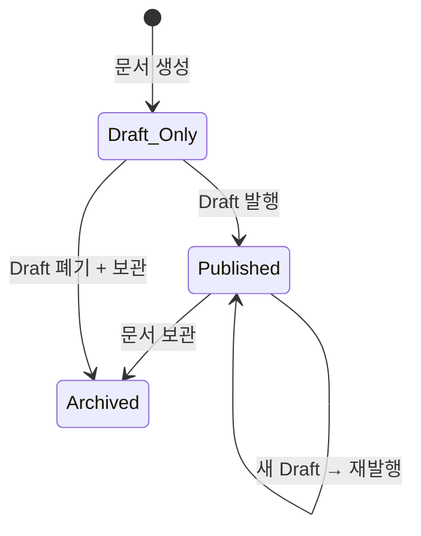

# Phase 4 - Task 4-1. 문서 작성/개정 생명주기 정의

---

## 1. 작업 목적

문서 플랫폼에서 문서가 생성되고 수정·발행·복원되는 전체 생명주기를 정의한다.  
이 문서는 Task 4-2, 4-4, 4-5, 4-6의 선행 기준 문서로 사용된다.

---

## 2. 용어 정의

| 용어 | 정의 |
|------|------|
| **Document** | 문서의 식별자, 메타데이터, 현재 상태 포인터를 보유하는 최상위 엔티티. 문서의 "이름표" 역할. |
| **Version** | 특정 시점의 문서 구조 스냅샷. 모든 변경 이력의 기록 단위. Draft 또는 Published 상태를 가진다. |
| **Draft Version** | 작성/편집 중인 미발행 버전. 아직 공식 참조 대상이 아니다. |
| **Published Version** | 공식 발행된 버전. 외부 사용자가 기본 조회하는 대상. 문서당 1개만 현재 공식 상태를 가진다. |
| **Superseded Version** | 이전에 Published였으나 새 Published로 대체되어 이력으로만 남은 버전. |
| **Discarded Draft** | 발행되지 않고 명시적으로 폐기된 Draft Version. |
| **Restored Version** | 과거 특정 버전을 기반으로 생성된 새 Draft Version. 복원 출처를 `restored_from_version_id`로 추적한다. |
| **Current Published View** | 문서 조회 시 일반 사용자에게 기본 노출되는 최신 Published Version. |
| **Current Draft View** | 편집 권한 사용자가 작업하는 현재 활성 Draft Version. |

---

## 3. 생명주기 개요

**Document 수준 상태 의미:**

| 상태 | 의미 | current_published_version_id |
|------|------|------------------------------|
| `draft` | 발행 이력 없음. Draft 버전만 존재. | NULL |
| `published` | 현재 공식 발행 버전 있음. Draft 동시 존재 가능. | SET |
| `archived` | 더 이상 활성 운영하지 않는 문서. | 유지 또는 NULL |
| `deprecated` | 다른 문서로 대체됨 (후속 Phase). | 유지 |

---

## 4. 문서 상태 정의

### 4-1. `draft` (Draft Only)

| 항목 | 내용 |
|------|------|
| **의미** | 아직 한 번도 발행되지 않은 신규 문서. 작성 진행 중. |
| **진입 조건** | 문서 최초 생성 시 자동 부여. |
| **이탈 조건** | 첫 번째 Published 전환 성공 → `published` 상태로 변경. |
| **허용 행위** | Draft 편집, Draft 폐기, 문서 메타데이터 수정, 발행. |
| **금지 행위** | 일반 사용자 대상 공개 조회(Published 없으므로). |

### 4-2. `published`

| 항목 | 내용 |
|------|------|
| **의미** | 현재 공식 발행 버전이 존재하는 상태. 일반 사용자 조회 가능. |
| **진입 조건** | Draft → Published 전환 성공 시. |
| **이탈 조건** | 문서 보관(archived) 처리 또는 deprecated 전환. |
| **허용 행위** | Published 조회, 새 Draft 생성(수정 시작), 복원 시작, 메타데이터 수정. |
| **금지 행위** | Published Version 직접 내용 수정. |

### 4-3. `archived`

| 항목 | 내용 |
|------|------|
| **의미** | 운영 종료 문서. 이력 조회는 허용하나 신규 편집/발행 원칙적 제한. |
| **진입 조건** | 관리자 또는 발행 권한자의 명시적 보관 처리. |
| **이탈 조건** | 보관 해제(unarchive) 시 `published` 또는 `draft`로 복귀 가능. |
| **허용 행위** | 과거 버전 이력 조회, 보관 해제. |
| **금지 행위** | 신규 Draft 생성, 발행. |

---

## 5. 버전 생성 규칙

### 5-1. Version Status 정의

| Version.status | 의미 | 문서당 개수 |
|---------------|------|------------|
| `draft` | 작성 중 미발행 버전 | 0 또는 1 (단일 Draft 정책) |
| `published` | 현재 공식 발행 버전 | 0 또는 1 |
| `superseded` | 이전 Published로, 새 Published로 대체된 이력 버전 | N |
| `discarded` | 발행되지 않고 폐기된 Draft | N |

### 5-2. 버전 생성 시점 규칙

| 시점 | 새 Version 생성 여부 | 설명 |
|------|---------------------|------|
| 문서 최초 생성 | **항상 생성** | Document + Draft Version 1이 동시에 생성된다. |
| Draft 내용 편집 (노드 수정) | **생성 안 함** | 현재 Draft Version의 Node를 in-place 갱신. Version 번호 증가 없음. |
| Published 전환 (Publish) | **상태 전환** | Draft Version 상태를 `draft` → `published`로 변경. 별도 Version 생성 없음. |
| Published 이후 수정 시작 | **새 Draft Version 생성** | 기존 Published는 그대로 유지. 새 version_number가 부여된 Draft Version 생성. |
| 복원(Restore) 요청 | **새 Draft Version 생성** | 과거 Version을 기반으로 새 Draft 생성. `restored_from_version_id`에 출처 기록. |
| 문서 메타데이터만 수정 | **생성 안 함 (원칙)** | Document 레벨 수정. Version 번호 증가 없음. (운영 정책에 따라 조정 가능.) |

### 5-3. version_number 부여 규칙

- version_number는 Document 범위 내에서 단조 증가하는 정수 (1-based).
- 새 Version 객체가 생성될 때만 증가한다 (Draft 편집, 상태 전환으로는 증가하지 않음).
- Restore로 생성된 새 Draft도 새 version_number를 부여받는다.

---

## 6. Draft / Published 관계 규칙

| 규칙 | 내용 |
|------|------|
| **단일 Draft 원칙** | 문서당 활성 Draft Version은 1개만 허용. `current_draft_version_id` 포인터로 관리. |
| **단일 Published 원칙** | 문서당 현재 공식 Published Version은 1개만 허용. `current_published_version_id` 포인터로 관리. |
| **공존 허용** | Draft와 Published는 동시에 공존 가능. Published 이후 수정 시작 시 Draft + Published 공존 상태 발생. |
| **Publish 시 Draft 소비** | Publish 성공 후 Draft Version 상태 → `published`. Document.current_draft_version_id → NULL. |
| **Publish 시 기존 Published 처리** | 기존 Published Version 상태 → `superseded`. Document.current_published_version_id → 새 Published Version. |

**Document 포인터 상태 정리:**

| 상황 | current_draft_version_id | current_published_version_id |
|------|--------------------------|------------------------------|
| 문서 생성 직후 | Draft v1 | NULL |
| 첫 Published 직후 | NULL | Published v1 |
| 수정 시작 후 | Draft v2 | Published v1 |
| 재발행 직후 | NULL | Published v2 |
| 복원 시작 후 | Draft v3 (restored) | Published v2 |

---

## 7. 복원 규칙

### 7-1. 복원의 정의

> 복원(Restore)은 과거 특정 Version의 내용을 **현재 시점의 새 Draft Version으로 재현**하는 행위다.  
> 과거 Version 자체를 수정하거나 시스템 상태를 과거로 되돌리지 않는다.

### 7-2. 복원 처리 흐름

1. **입력**: 복원 기준 Version ID (`source_version_id`)
2. **선행 조건 검사**: 
   - 대상 Document가 존재하고 archived/deprecated가 아닌지 확인.
   - 현재 활성 Draft가 없어야 함 (있으면 선행 폐기 또는 오류 반환).
3. **처리**:
   - 새 Draft Version 생성 (새 version_number 부여)
   - source_version의 Node 트리 복사 → 새 Version에 귀속
   - `restored_from_version_id` = source_version_id 기록
   - `parent_version_id` = Document.current_published_version_id (복원 직전 공식 버전)
   - Document.current_draft_version_id → 새 Draft
4. **결과**: 새 Draft Version이 생성됨. 편집 가능 상태.
5. **이후 흐름**: 복원된 Draft를 그대로 발행하거나, 추가 편집 후 발행.

### 7-3. 복원 대상 제약

- 이미 현재 활성 Draft가 있는 경우: 복원 불가. 기존 Draft 폐기 후 요청 재시도.
- archived/deprecated 문서: 복원 불가 (관리자 권한 예외 가능).
- 존재하지 않는 Version ID: 오류 반환.

### 7-4. 감사 추적 포인트

- 복원 요청자 (actor_id)
- 복원 출처 Version ID (`restored_from_version_id`)
- 복원 결과 생성된 Version ID
- 복원 이유 (`change_summary` 필드 활용)

---

## 8. 대표 시나리오

### 시나리오 1: 새 문서 작성 후 Draft 저장

| 항목 | 내용 |
|------|------|
| **시작 조건** | 문서가 존재하지 않음. |
| **사용자 행위** | 새 문서 생성 요청 (title, document_type, 초기 노드 내용). |
| **시스템 반응** | Document 생성 (status=draft) + Version 1 생성 (status=draft) + Node 저장. |
| **상태 변화** | Document.status = "draft", current_draft_version_id = v1, current_published_version_id = NULL. |
| **생성 엔티티** | Document, Version(v1, draft), Node 트리. |
| **감사 포인트** | document.created, version.created. |

### 시나리오 2: Draft 내용 편집

| 항목 | 내용 |
|------|------|
| **시작 조건** | Document(draft), current_draft_version_id = v1 존재. |
| **사용자 행위** | Draft 편집 (노드 내용 수정/추가/삭제). |
| **시스템 반응** | Version 1의 Node 트리 in-place 갱신. 새 Version 생성 없음. |
| **상태 변화** | Version 1 노드 내용 변경. Document 포인터 변화 없음. |
| **생성 엔티티** | 수정된 Node들 (기존 Version에 귀속). |
| **감사 포인트** | version.nodes_updated. |

### 시나리오 3: Draft 문서를 첫 Published로 전환

| 항목 | 내용 |
|------|------|
| **시작 조건** | Document(draft), current_draft_version_id = v1, current_published = NULL. |
| **사용자 행위** | 발행(Publish) 요청. |
| **시스템 반응** | Version 1 status → "published". Document.status → "published". current_published_version_id = v1. current_draft_version_id → NULL. |
| **상태 변화** | Document: draft → published. v1: draft → published. |
| **생성 엔티티** | 없음 (상태 전환만). |
| **감사 포인트** | version.published, document.status_changed. |

### 시나리오 4: Published 문서를 수정하여 새 Draft 생성

| 항목 | 내용 |
|------|------|
| **시작 조건** | Document(published), v1=published, current_draft = NULL. |
| **사용자 행위** | 수정 시작 (편집 모드 진입 요청). |
| **시스템 반응** | Version 2 생성 (status=draft, parent_version_id=v1). current_draft_version_id = v2. |
| **상태 변화** | Document: published (유지). 새 v2(draft) 추가. v1(published) 유지. |
| **생성 엔티티** | Version 2 (draft), 복사된 Node 트리 또는 빈 Node 트리. |
| **감사 포인트** | version.created (draft). |

### 시나리오 5: 새 Draft를 다시 Published로 전환

| 항목 | 내용 |
|------|------|
| **시작 조건** | Document(published), v1=published, v2=draft (current_draft). |
| **사용자 행위** | 재발행(Publish) 요청. |
| **시스템 반응** | v2 status → "published". v1 status → "superseded". current_published = v2. current_draft → NULL. |
| **상태 변화** | v1: published → superseded. v2: draft → published. |
| **생성 엔티티** | 없음 (상태 전환만). |
| **감사 포인트** | version.published, version.superseded, document.republished. |

### 시나리오 6: 과거 Published 버전을 기반으로 복원

| 항목 | 내용 |
|------|------|
| **시작 조건** | Document(published), v2=published (current), v1=superseded. current_draft = NULL. |
| **사용자 행위** | v1 복원 요청 (restore from v1). |
| **시스템 반응** | v3 생성 (draft, parent_version_id=v2, restored_from_version_id=v1). v1의 Node 트리 복사. current_draft = v3. |
| **상태 변화** | v3(draft) 추가됨. v1, v2 상태 변화 없음. |
| **생성 엔티티** | Version 3 (draft), 복사 Node 트리. |
| **감사 포인트** | version.restored (source=v1), version.created. |

### 시나리오 7: Draft가 있는 상태에서 수정 반복

| 항목 | 내용 |
|------|------|
| **시작 조건** | Document(published), v2=published, v3=draft (current_draft). |
| **사용자 행위** | Draft 편집 반복. |
| **시스템 반응** | v3의 Node 트리 in-place 갱신. Version 번호 증가 없음. |
| **상태 변화** | v3 Node 내용만 변경. Document 포인터 유지. |
| **생성 엔티티** | 수정된 Node들. |
| **감사 포인트** | version.nodes_updated. |

### 시나리오 8: 아직 Published되지 않은 문서의 일반 조회

| 항목 | 내용 |
|------|------|
| **시작 조건** | Document(draft), v1=draft (current_draft). Published 없음. |
| **사용자 행위** | 일반 사용자 문서 조회 요청. |
| **시스템 반응** | current_published_version_id = NULL → 404 또는 "발행 전 문서" 응답 반환. |
| **상태 변화** | 없음. |
| **생성 엔티티** | 없음. |
| **감사 포인트** | 해당 없음 (접근 차단). |

---

## 9. 상태 전이표

### 9-1. Document 상태 전이

| 현재 상태 | 수행 액션 | 가능 여부 | 다음 상태 | 비고 |
|-----------|-----------|-----------|-----------|------|
| `draft` | Publish | 가능 | `published` | Draft → Published 전환 성공 시 |
| `draft` | Draft 폐기 | 가능 | `draft` 유지 또는 `archived` | Published 없으므로 문서 자체가 남음 |
| `draft` | 편집 | 가능 | `draft` 유지 | |
| `published` | 수정 시작 | 가능 | `published` 유지 | 새 Draft 생성만. Document 상태 불변 |
| `published` | Publish | 가능 | `published` 유지 | 기존 Published superseded, 새 Published 지정 |
| `published` | 보관 | 가능 | `archived` | |
| `published` | 즉시 삭제 | 제한 | - | Published 직접 삭제는 원칙적으로 금지 |
| `archived` | 편집/발행 | 금지 | - | 보관 해제 선행 필요 |
| `archived` | 보관 해제 | 가능 | `published` 또는 `draft` | 이전 상태로 복귀 |

### 9-2. Version 상태 전이

| 현재 상태 | 수행 액션 | 가능 여부 | 다음 상태 | 비고 |
|-----------|-----------|-----------|-----------|------|
| `draft` | Publish | 가능 | `published` | 현재 활성 Draft가 Published로 전환 |
| `draft` | 편집(노드 수정) | 가능 | `draft` 유지 | in-place 갱신 |
| `draft` | 폐기(Discard) | 가능 | `discarded` | 더 이상 활성 Draft 아님 |
| `published` | Republish (새 Published 전환) | 가능 | `superseded` | 새 Published 생성 시 기존 Published superseded |
| `published` | 직접 내용 수정 | **금지** | - | Published는 불변 |
| `published` | 복원 소스로 사용 | 가능 | `published` 유지 | 새 Draft 생성만. 이 Version은 변화 없음 |
| `superseded` | 모든 수정 | **금지** | - | 이력 전용 |
| `superseded` | 복원 소스로 사용 | 가능 | `superseded` 유지 | |
| `discarded` | 모든 수정 | **금지** | - | 이력 전용 |

---

## 10. 후속 작업에 미치는 영향

| 후속 Task | 영향 |
|-----------|------|
| **Task 4-2 (버전 모델 상세 설계)** | `Version.status` 4가지 값 (draft/published/superseded/discarded), `parent_version_id`, `restored_from_version_id` 필드 필요. Document에 `current_draft_version_id`, `current_published_version_id` 포인터 필요. |
| **Task 4-4 (API 설계)** | `POST /documents` (Document + v1 Draft 동시 생성), `POST /documents/{id}/versions` (새 Draft), `POST /documents/{id}/versions/{vid}/publish`, `POST /documents/{id}/versions/{vid}/restore`, `DELETE /documents/{id}/versions/{vid}` (Draft 폐기) 엔드포인트 필요. |
| **Task 4-5 (Draft/Published 정책)** | 단일 Draft 정책, Published는 문서당 1개, 복원 시 기존 Draft 충돌 처리 규칙. |
| **Task 4-6 (조회/복원 흐름)** | 일반 조회 = current_published 기준, 편집 조회 = current_draft 명시 조회. |
| **Task 4-8 (권한/감사)** | version.published, version.restored, version.discarded 감사 이벤트 정의 필요. |
