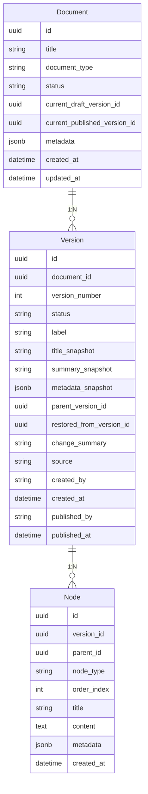
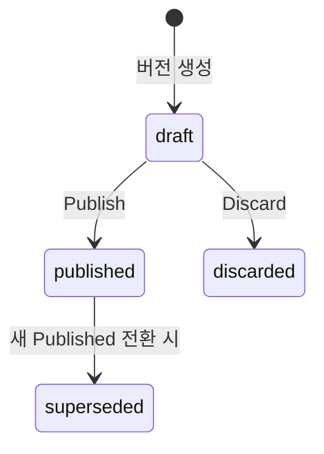
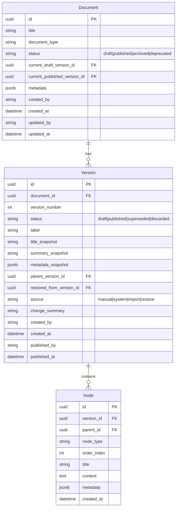

# Phase 4 - Task 4-2. 버전 모델 상세 설계

---

## 1. 작업 목적

Version 엔티티를 실제 구현 가능한 수준으로 구체화한다.  
이 문서는 Task 4-4, 4-5, 4-6 및 구현 단계 DB/서비스 설계의 기준 문서다.

---

## 2. Version 모델 개요

Version은 **문서 이력 관리의 공식 기록 단위**다.

- 단순 보조 엔티티가 아니라, 특정 시점의 문서 상태를 완전하게 재현할 수 있는 스냅샷이다.
- Draft와 Published를 구분하는 동일 모델이다. `status` 필드로 현재 역할을 표현한다.
- Node 트리는 Version에 귀속된다. `Version.id` ← `Node.version_id`.
- 한 번 생성된 Version의 핵심 내용(스냅샷 필드, Node 트리)은 불변이다.

### 2-1. Document와의 관계



### 2-2. 역할 요약

| 항목 | Version의 역할 |
|------|----------------|
| **조회 시점** | current_published_version_id → 일반 사용자에게 노출할 버전 결정. |
| **편집 시점** | current_draft_version_id → 편집자가 작업하는 현재 버전 결정. |
| **복원 시점** | 과거 Version을 기반으로 새 Draft 생성. 원본 Version은 불변 유지. |
| **감사 추적** | created_by, created_at, published_by, published_at으로 "누가 언제 만들었고 발행했는가" 기록. |

---

## 3. Version 식별 전략

### 3-1. 식별자 체계

| 식별자 | 타입 | 목적 | 특성 |
|--------|------|------|------|
| `id` | UUID | 시스템 내부 고유 식별자 | 불변, 전역 고유 |
| `version_number` | Integer (1-based) | Document 범위 내 순번 | Document 내 단조 증가 |
| `label` | String (nullable) | 사용자 표시용 이름 | 선택 입력, 변경 가능 |

**`version_number` 부여 규칙:**
- Document 범위 내에서 1부터 시작해 새 Version 생성 시마다 1씩 증가.
- Draft 편집(in-place 갱신)은 version_number를 증가시키지 않는다.
- 상태 전환(draft → published)도 version_number를 증가시키지 않는다.
- Restore로 생성된 새 Draft도 새 version_number를 부여받는다.

**`label` 활용 예시:**
- `"v1.0"`, `"2026-04 개정"`, `"초안 3차"` 등 운영자가 의미 부여 가능.
- 발행 시 `label`을 자동 설정하는 정책은 운영 구성으로 결정 (구현 강제 없음).

---

## 4. Version 상태 모델

### 4-1. 상태 정의

| status | 의미 | 문서당 동시 존재 가능 수 |
|--------|------|------------------------|
| `draft` | 작성 중인 미발행 버전. 현재 활성 Draft. | 0 또는 1 |
| `published` | 현재 공식 발행 버전. 일반 사용자 조회 기준. | 0 또는 1 |
| `superseded` | 이전 Published로, 새 Published 전환 시 자동 전환. 이력 보존. | N |
| `discarded` | 발행되지 않고 명시적으로 폐기된 Draft. 이력 보존. | N |

### 4-2. 상태 전이



### 4-3. 최소 상태 vs 확장 상태 비교

| 비교 항목 | 최소 상태 방식 (draft/published만) | 채택안 (4가지 상태) |
|-----------|-----------------------------------|-------------------|
| **구현 복잡도** | 낮음 | 보통 |
| **이력 명확성** | 낮음 (archived가 폐기/대체 모두 의미) | 높음 (superseded vs discarded 구분) |
| **감사 추적** | 불명확 | 명확 |
| **승인 워크플로 확장** | 어려움 | 용이 |

**채택: 4가지 상태 (draft / published / superseded / discarded)**

> 이유: 이력 조회 시 "이 버전이 발행됐다가 대체된 것인가, 처음부터 폐기된 것인가"를 구분하는 것이  
> 감사 추적과 향후 diff/비교 기능에서 중요하다.

---

## 5. 스냅샷 범위 정의

### 5-1. 스냅샷 포함 여부 판단

| 정보 항목 | 스냅샷 보관 | 판단 근거 |
|-----------|------------|-----------|
| 제목 (`title_snapshot`) | **필수** | Document.title은 현재값만 보관. 과거 버전 재현 시 필요. |
| 요약 (`summary_snapshot`) | **권장** | 버전 목록 조회 시 context 제공. 재현 보조. |
| 메타데이터 (`metadata_snapshot`) | **필수** | 시행일·개정일 등 버전마다 다를 수 있는 핵심 속성 포함. |
| document_type | **불필요 (참조로 충분)** | Document.document_type은 거의 변경 안 됨. 변경 이력 필요 시 후속 Phase 추가. |
| Node 트리 본문 | **Version 종속 구조** | Node.version_id로 귀속. 별도 스냅샷 필드 불필요. |
| 발행 일시 (`published_at`) | **필수** | 이 버전이 언제 공식화됐는지 기록. NULL = 미발행. |
| 발행자 (`published_by`) | **필수** | 감사 추적 필수 포인트. |
| content_hash / checksum | **후속 Phase** | 무결성 검증용. MVP 제외. |

### 5-2. 스냅샷 vs Document 현재값 차이 예시

| 조회 시점 | title | title_snapshot |
|-----------|-------|----------------|
| Document.title = "ABC 규정" | "ABC 규정" | "ABC 규정" |
| Document.title이 "ABC 정책"으로 변경 후 | "ABC 정책" | "ABC 규정" ← 과거 버전에서 유지 |

---

## 6. Document-Version 연결 방식

### 6-1. 포인터 구조

Document는 두 개의 외래 키 포인터를 가진다:

| 포인터 | 참조 대상 | 의미 | NULL 허용 |
|--------|-----------|------|----------|
| `current_draft_version_id` | Version.id | 현재 활성 Draft. 편집 작업 기준. | 허용 (Draft 없을 때) |
| `current_published_version_id` | Version.id | 현재 공식 Published. 일반 조회 기준. | 허용 (미발행 문서) |

### 6-2. 포인터 갱신 시점

| 액션 | current_draft_version_id | current_published_version_id |
|------|--------------------------|------------------------------|
| 문서 생성 | 새 Draft ID 설정 | NULL 유지 |
| 새 Draft 생성 (수정 시작) | 새 Draft ID로 교체 | 변화 없음 |
| Publish | NULL로 초기화 | 새 Published ID로 교체 |
| Draft 폐기 | NULL로 초기화 | 변화 없음 |
| Restore | 새 Draft ID 설정 | 변화 없음 |

### 6-3. Phase 1과의 비교 및 결정

Phase 1에서는 `current_version_id`와 `latest_version_id` 두 포인터를 제안했다.  
Phase 4에서는 **Draft와 Published의 명시적 분리**를 위해 두 포인터를 달리 정의한다.

| Phase 1 방식 | Phase 4 채택 방식 | 이유 |
|-------------|-------------------|------|
| `current_version_id` (Published 기준) | `current_published_version_id` | 동일 개념, 명칭 명확화 |
| `latest_version_id` (최신 Draft 포함) | `current_draft_version_id` | Draft임을 명시적으로 표현 |

---

## 7. Version Lineage (계보) 정의

### 7-1. Lineage 필드

| 필드 | 타입 | 의미 | 설정 시점 |
|------|------|------|----------|
| `parent_version_id` | UUID (nullable) | 이 버전이 기반한 직전 활성 버전 | 수정 시작 시 (current_published 또는 최신 버전 ID) |
| `restored_from_version_id` | UUID (nullable) | 복원 출처 버전 ID | Restore 시에만 설정 |

### 7-2. Lineage 표현 예시

```
v1 (draft) ──publish──> v1 (published)
                              │
                              │ 수정 시작 (parent = v1)
                              ▼
                         v2 (draft)
                              │
                              │ publish
                              ▼
                    v1 (superseded)  v2 (published)
                                          │
                                          │ restore from v1 (parent = v2, restored_from = v1)
                                          ▼
                                     v3 (draft, restored)
```

### 7-3. Restore 출처 추적 가능 여부

- `restored_from_version_id = v1.id` 설정 → "v1을 기반으로 복원된 Draft"임을 명확히 알 수 있음.
- `parent_version_id = v2.id` → 복원 시점 기준 공식 버전도 추적 가능.
- 이 두 필드로 "이 버전이 어떤 맥락에서 만들어졌는가"를 완전하게 재현 가능.

---

## 8. 복원 관점 설계

### 8-1. 복원 시 Version 생성 규칙

- 복원은 항상 **새 Draft Version 생성**으로 처리한다.
- 과거 Version을 직접 다시 활성화(status 변경)하지 않는다.
- 복원된 Draft는 일반 Draft와 동일하게 편집 가능하며 발행 가능하다.

### 8-2. 복원 Version의 특수성 표현 방법

`restored_from_version_id` 필드가 NULL이 아닌 경우 → 이 Draft가 복원 기반임을 나타낸다.  
별도 `source` 필드 값으로도 구분한다: `source = "restore"`.  
`change_summary`에 복원 사유 기록 권장.

### 8-3. 복원 시 Node 처리

- 복원 소스 Version의 Node 트리를 **전체 복사**하여 새 Draft Version에 귀속시킨다.
- 원본 Node는 원본 Version에 귀속된 채 불변 유지.
- 복사된 Node는 새 Version에 새 ID로 생성됨.

---

## 9. 필드 후보 표

| 필드명 | 타입 | 목적 | 필수 | MVP 포함 | 변경 가능 |
|--------|------|------|------|----------|----------|
| `id` | UUID | Version 고유 식별자 | 필수 | Y | 불변 |
| `document_id` | UUID | 소속 Document 참조 | 필수 | Y | 불변 |
| `version_number` | Integer | Document 내 순번 (1-based) | 필수 | Y | 불변 |
| `status` | Enum | draft / published / superseded / discarded | 필수 | Y | 상태 전환으로만 변경 |
| `label` | String (nullable) | 사용자 표시용 버전 이름 | 선택 | Y | 변경 가능 |
| `title_snapshot` | String | 이 버전 생성 시점 문서 제목 복사본 | 필수 | Y | 불변 |
| `summary_snapshot` | String (nullable) | 이 버전 생성 시점 요약 복사본 | 선택 | Y | 불변 |
| `metadata_snapshot` | JSONB | 이 버전 생성 시점 메타데이터 복사본 | 필수 | Y | 불변 |
| `parent_version_id` | UUID (nullable) | 이 버전의 기반이 된 직전 버전 | 선택 | Y | 불변 |
| `restored_from_version_id` | UUID (nullable) | 복원 출처 버전 ID (복원 시에만 설정) | 선택 | Y | 불변 |
| `source` | Enum | 버전 생성 원인: manual / system / import / restore | 필수 | Y | 불변 |
| `change_summary` | String (nullable) | 변경 요약 (작성자 입력) | 선택 | Y | 변경 가능 |
| `created_by` | String (nullable) | 버전 생성자 actor_id | 선택 | Y | 불변 |
| `created_at` | Timestamp | 버전 생성 일시 | 필수 | Y | 불변 |
| `published_by` | String (nullable) | 발행 처리자 actor_id | 선택 | Y | Publish 시 설정, 이후 불변 |
| `published_at` | Timestamp (nullable) | 발행 일시. NULL = 미발행 | 선택 | Y | Publish 시 설정, 이후 불변 |
| `content_hash` | String (nullable) | Node 트리 무결성 해시 | 선택 | N (후속) | Publish 시 계산 권장 |

---

## 10. 권장 모델안 및 선택 근거

### 최종 채택: 단일 Version 모델 + Lineage 필드 포함 (안 A 확장형)

| 항목 | 결정 | 근거 |
|------|------|------|
| Draft/Published 표현 방식 | 단일 Version 모델 + status 필드 | 구현 단순. 상태 전환이 명확. |
| Document 포인터 | current_draft_version_id + current_published_version_id | Draft/Published 공존 상태에서 각각 명확히 참조 가능. |
| Lineage | parent_version_id + restored_from_version_id | 최소한의 계보 정보. diff/승인 확장 기반. |
| 스냅샷 범위 | title + summary + metadata | 과거 버전 재현에 필수적인 것만. document_type은 제외(불변에 가까움). |
| Publish 시 별도 Version 생성 여부 | 생성 안 함 (상태 전환만) | 단순화. Draft가 그대로 Published로 전환됨. |
| 복원 방식 | 새 Draft Version 생성 | 이력 무결성 보장. |

### 대안 (안 B: 계보형 풍부 모델) 미채택 근거

Phase 5에서 승인 워크플로, Phase 9에서 diff 기능이 별도로 설계될 예정이므로, 이번 Phase에서 과도한 lineage 모델링은 불필요하다. `parent_version_id`와 `restored_from_version_id` 두 필드로 충분한 계보 표현이 가능하다.

---

## 11. Mermaid ER 다이어그램 (확장)



---

## 12. 후속 작업 영향도

| 후속 Task | 영향 |
|-----------|------|
| **Task 4-4 (API 설계)** | 버전 생성 API에 `label`, `change_summary`, `source`, `parent_version_id` 포함. Publish API에 `published_by`, `published_at` 설정 로직. |
| **Task 4-5 (Draft/Published 정책)** | `current_draft_version_id` 단일 포인터로 단일 Draft 정책 구현. `current_published_version_id` 포인터로 Published 교체 처리. |
| **Task 4-6 (조회/복원 흐름)** | 조회 시 status 필터 + 포인터 기반 빠른 참조. 복원 시 `restored_from_version_id` 설정. |
| **구현 (DB 스키마)** | Document 테이블에 `current_draft_version_id`, `current_published_version_id` 컬럼 추가. Version 테이블에 `status` Enum 확장, `parent_version_id`, `restored_from_version_id`, `title_snapshot`, `summary_snapshot`, `metadata_snapshot`, `published_by`, `published_at` 추가. |
| **Phase 9 (diff)** | `parent_version_id` 기반 이전/현재 Version 비교 가능. |
| **Phase 11 (RAG)** | `published` 상태 Version의 Node만 인덱싱 → 권한 기반 검색 정확도 확보. |
