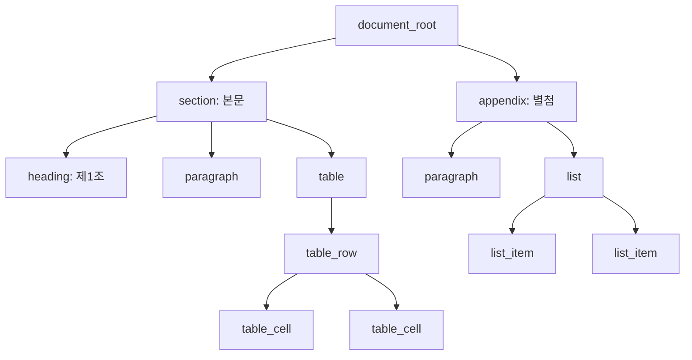
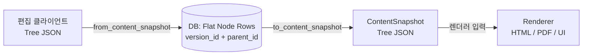

# Phase 4 - Task 4-3. 문서 저장 구조와 편집 단위 설계

---

## 1. 작업 목적

문서 본문을 어떤 구조로 저장하고, 어떤 단위로 수정하며, Version 스냅샷에 어떻게 포함할지를 정의한다.  
이 문서는 Task 4-4, 4-6, 4-7 및 구현 단계 저장/조회 로직의 기준 문서다.

---

## 2. 저장 구조 기본 모델 비교

### 2-1. 후보 비교

| 기준 | 순수 트리 구조 | 블록 리스트 중심 | 혼합 구조 (채택) |
|------|---------------|----------------|----------------|
| **범용 문서 확장성** | 높음 | 낮음 (깊은 중첩 표현 어려움) | 높음 |
| **구현 단순성** | 보통 | 높음 | 보통 |
| **버전 스냅샷 적합성** | 높음 | 보통 | 높음 |
| **렌더링 용이성** | 보통 (순회 필요) | 높음 (순차 처리) | 높음 |
| **diff/복원 확장성** | 높음 | 낮음 | 높음 |

### 2-2. 채택: 혼합 구조 (루트 트리 + 리프 레벨 블록 리스트)

**결정:** 문서 최상위 구조는 트리(섹션 계층), 본문 내용 블록은 순차 자식 배열로 표현한다.

```
document_root
  └─ section (§1)
       ├─ heading       ← 순차 블록
       ├─ paragraph     ← 순차 블록
       └─ paragraph     ← 순차 블록
  └─ section (§2)
       ├─ heading
       ├─ table
       └─ list
  └─ appendix (부록)
       └─ paragraph
```

**채택 근거:**
- 섹션/부록 등 문서 상위 구조는 명확한 계층이 필요 → 트리.
- 단락/표/리스트 등 본문 블록은 순서가 중요 → 리스트(order_index).
- DB에서는 flat node rows (parent_id + order_index)로 저장, API/렌더링에서는 중첩 트리로 변환.

---

## 3. DB 저장 전략: Flat Node Rows

### 3-1. 기본 원칙

- 모든 Node는 개별 DB 행으로 저장된다.
- 트리 관계는 `parent_id` + `order_index`로 표현한다.
- Version에 종속: `Node.version_id` FK.
- 내용 조회 시 `version_id`로 전체 노드를 가져와 메모리에서 트리 재구성.

```
DB rows (flat):
  [id=n1, version_id=v1, parent_id=NULL,  node_type=document_root, order_index=0]
  [id=n2, version_id=v1, parent_id=n1,   node_type=section,       order_index=0]
  [id=n3, version_id=v1, parent_id=n2,   node_type=heading,       order_index=0]
  [id=n4, version_id=v1, parent_id=n2,   node_type=paragraph,     order_index=1]
  [id=n5, version_id=v1, parent_id=n1,   node_type=section,       order_index=1]
```

### 3-2. 현재 구현과의 정렬

기존 `Node` 모델 ([backend/app/models/node.py](../../../../backend/app/models/node.py))은 이미 이 구조를 따른다.  
Phase 4에서 추가 필요한 것은 `node_type`별 `payload` 필드와 `content_snapshot` 직렬화 규약이다.

---

## 4. Node 공통 스키마 정의

### 4-1. 공통 필드 표

| 필드명 | 타입 | 목적 | 필수 | 변경 가능 | 스냅샷 포함 |
|--------|------|------|------|----------|------------|
| `id` | UUID | Node 고유 식별자. citation anchor로 사용. | 필수 | 불변 | 포함 |
| `version_id` | UUID | 소속 Version 참조 | 필수 | 불변 | 포함 (context) |
| `parent_id` | UUID (nullable) | 부모 Node. NULL = 최상위 (document_root) | 필수 | 불변 | 포함 |
| `node_type` | Enum String | 블록 타입 (paragraph / heading / section ...) | 필수 | 불변 | 포함 |
| `order_index` | Integer (≥ 0) | 형제 노드 간 정렬 인덱스 (0-based) | 필수 | 가변 | 포함 |
| `title` | String (nullable) | heading/section 등의 표시 제목 | 선택 | 가변 | 포함 |
| `content` | Text (nullable) | 텍스트 본문 (paragraph, list_item 등) | 선택 | 가변 | 포함 |
| `metadata` | JSONB | 타입별 확장 속성 및 렌더링 힌트 | 선택 | 가변 | 포함 |
| `created_at` | Timestamp | 이 Node가 생성된 시점 (= 해당 Version 생성 시점) | 필수 | 불변 | 포함 |

### 4-2. 제외 필드 결정

| 필드 후보 | 결정 | 이유 |
|-----------|------|------|
| `annotations` | 후속 Phase | 댓글/하이라이트는 Phase 4 범위 외 |
| `is_deleted` (soft-delete) | 불필요 | Version 전체 스냅샷 방식이므로 개별 Node soft-delete 없음. Version 자체를 폐기 |
| `children` (embedded) | DB에서 제외 | Flat rows 방식. children은 조회 시 메모리 재구성 |
| `locked` | 후속 Phase | 동시 편집 잠금은 Phase 4 범위 외 |

---

## 5. 기본 블록 타입 정의

### 5-1. Phase 4 MVP 지원 타입

| node_type | 의미 | 허용 부모 | 허용 자식 | 필수 payload |
|-----------|------|----------|----------|-------------|
| `document_root` | 문서 최상위 컨테이너 | 없음 (루트) | section, appendix | 없음 |
| `section` | 섹션 (챕터 단위) | document_root, section | section, heading, paragraph, list, table, quote | `title` (string) |
| `heading` | 제목/소제목 | section, document_root | 없음 (리프) | `level` (1~6, int), `title` (string) |
| `paragraph` | 문단 텍스트 | section, appendix, quote | 없음 (리프) | `content` (string) |
| `list` | 목록 컨테이너 | section, appendix | list_item | `list_type` ("bullet"\|"ordered") |
| `list_item` | 목록 항목 | list | list (중첩) | `content` (string) |
| `table` | 표 컨테이너 | section, appendix | table_row | `caption` (string, optional) |
| `table_row` | 표 행 | table | table_cell | 없음 |
| `table_cell` | 표 셀 | table_row | 없음 (리프) | `content` (string), `colspan` (int, default 1), `rowspan` (int, default 1) |
| `quote` | 인용/발췌 | section, appendix | paragraph | `source` (string, optional) |
| `appendix` | 부록/참고 섹션 | document_root | section, heading, paragraph, list, table | `title` (string) |

### 5-2. 후속 Phase 확장 예약 타입

| node_type | 예정 Phase |
|-----------|-----------|
| `code_block` | Phase 6 (UI) 또는 Phase 12 (타입 확장) |
| `image` | Phase 6 (UI) |
| `attachment` | Phase 6 (UI) |
| `callout` | Phase 12 (타입 확장) |
| `embed` | Phase 11 (RAG 연계) |

---

## 6. payload 설계 원칙

### 6-1. 필드 분리 기준

| 항목 | 저장 위치 | 기준 |
|------|----------|------|
| 의미적 본문 | `content` 필드 | 사람이 읽는 텍스트. 렌더링 주 재료. |
| 구조 식별 | `node_type` + `title` | 블록 역할과 표시 제목 |
| 타입별 추가 속성 | `metadata` JSONB | 렌더링 힌트, 타입별 확장 (level, list_type 등) |
| 시스템/플랫폼 관리 정보 | 공통 필드 (id, version_id, etc.) | 구조 관리 목적 |

### 6-2. 텍스트 저장 방식

- 단순 텍스트(paragraph, list_item, table_cell): `content` 필드에 plain text 저장.
- Phase 4에서는 인라인 서식(bold, italic, link)을 지원하지 않는다.
- 인라인 서식은 Phase 6 에디터 UI 연동 시 `content`를 Markdown 또는 지정 inline 포맷으로 확장한다.

### 6-3. metadata JSONB 활용 예시

```json
// heading node
{ "level": 2 }

// list node
{ "list_type": "ordered" }

// table_cell node
{ "colspan": 2, "rowspan": 1, "is_header": true }

// section node (document_type 특화 확장 예)
{ "regulation_code": "제3조", "effective_date": "2026-01-01" }
```

> `metadata`는 자유 확장 구조이므로, DocumentType별 추가 속성을 수용할 수 있다.  
> schema 관리는 DocumentType 플러그인 레이어에서 담당한다 (Phase 12).

### 6-4. 빈 payload 허용 여부

- `document_root`, `table_row`: content, title 모두 NULL 허용.
- `paragraph`, `heading`, `list_item`, `table_cell`: `content` 또는 `title` 중 하나는 있어야 한다 (validation 참조).

---

## 7. 전체 저장 vs 부분 수정 전략

### 7-1. 비교

| 항목 | 안 A: 전체 저장 중심 (채택) | 안 B: 부분 블록 수정 |
|------|---------------------------|---------------------|
| **구현 복잡도** | 낮음 | 높음 |
| **버전 정합성** | 항상 보장 | 부분 실패 시 불일치 위험 |
| **네트워크 효율** | 낮음 (큰 문서) | 높음 |
| **복원 단순성** | 높음 | 낮음 (부분 패치 이력 관리 필요) |
| **diff 확장성** | 높음 (전체 스냅샷 비교) | 보통 |

**결정: 안 A (전체 저장 중심) 채택**

> 사용자 편집 UX는 부분 수정처럼 보이더라도,  
> **내부 저장 단위는 항상 해당 Version의 전체 Node 트리 교체**다.  
> 이 원칙이 버전 무결성과 복원 단순성을 보장한다.

### 7-2. 점진적 전환 계획

Phase 4~5에서는 전체 저장 중심으로 구현한다.  
Phase 6+ 에디터 UI 도입 시 실시간 자동 저장(autosave) 필요성이 높아지면,  
부분 패치 → 최종 전체 저장(commit) 패턴으로 전환 가능하다.

---

## 8. 편집 단위 기준

| 관점 | 단위 | 설명 |
|------|------|------|
| **사용자 편집 단위** | Node 수준 (임의의 블록) | 사용자는 특정 단락 하나만 수정할 수 있음 |
| **API 요청 단위** | 전체 content tree | 클라이언트는 수정된 전체 트리를 전송 |
| **저장 반영 단위** | Version의 전체 Node 집합 | DB에서 기존 Draft의 Node를 삭제 후 새 Node 전체 삽입 |
| **Version 스냅샷 단위** | 전체 Node 트리 | 한 Version = 한 시점의 완전한 문서 구조 |

**구현 흐름:**
```
사용자 편집 → 클라이언트에서 전체 트리 재구성 →
PUT /documents/{id}/draft (전체 content tree 전송) →
서비스: 기존 Draft Version의 Node 전체 삭제 + 새 Node 일괄 삽입
```

---

## 9. Version content_snapshot 구조 정의

### 9-1. 두 가지 표현 방식

| 표현 방식 | 용도 | 구조 |
|-----------|------|------|
| **DB 저장: Flat Node Rows** | 쿼리, 검색, citation | 개별 Node 행, version_id FK |
| **API 응답: Tree JSON** | 렌더링, 복원, 직렬화 | 중첩 children 배열 구조 |

### 9-2. Tree JSON 구조 정의 (content_snapshot 포맷)

```
ContentSnapshot = {
  "root": NodeTree
}

NodeTree = {
  "id": string (UUID),
  "node_type": string,
  "order_index": integer,
  "title": string | null,
  "content": string | null,
  "metadata": object,
  "children": NodeTree[]   ← 재귀
}
```

**특성:**
- `id`: DB의 Node UUID 그대로 유지. citation anchor 역할.
- `version_id`: 스냅샷 내부에서는 생략 가능 (Version context에서 명확하므로).
- `parent_id`: 스냅샷에서는 생략 (children 중첩 구조로 대체).
- `order_index`: 형제 간 순서 보존.

### 9-3. 변환 규약

- **DB → Tree**: `version_id`로 전체 Node 행 조회 → 메모리에서 `parent_id` 기준 트리 재구성.
- **Tree → DB**: 전체 트리 순회(DFS) → flat rows 생성 후 bulk insert.

### 9-4. 빈 문서 표현

```json
{
  "root": {
    "id": "<uuid>",
    "node_type": "document_root",
    "order_index": 0,
    "title": null,
    "content": null,
    "metadata": {},
    "children": []
  }
}
```

### 9-5. 복원에 필요한 최소 정보

content_snapshot만으로 복원이 가능해야 한다.  
`id`, `node_type`, `order_index`, `title`, `content`, `metadata`, `children` 포함이면 충분하다.  
복원 시: 스냅샷 트리 순회 → 새 UUIDs 발급 → 새 Draft Version에 귀속시켜 저장.

---

## 10. 구조 유효성 검증 규칙

### 10-1. Node 단위 검증

| 검증 항목 | 규칙 |
|-----------|------|
| `node_type` 유효성 | 정의된 Enum 값 중 하나여야 함 |
| `order_index` | 0 이상 정수. 형제 간 중복 허용하지 않음 (서비스 레이어 정렬 재부여) |
| `title` / `content` 공백 | heading: `title` 필수 (비어있으면 경고, 오류는 아님) |
| `metadata` 크기 | Node 단위 64KB 제한 |
| 허용되지 않은 자식 타입 | 블록 타입별 허용 자식 목록 검사 (§5 표 참조) |

### 10-2. 트리 구조 검증

| 검증 항목 | 규칙 |
|-----------|------|
| 루트 노드 | `document_root` 타입이 정확히 1개. `parent_id = NULL`. |
| 순환 참조 | 허용하지 않음. 트리 구성 시 사이클 감지. |
| 고아 노드 | `parent_id`가 같은 Version 내 존재하지 않는 Node를 가리키면 오류. |
| 허용되지 않는 중첩 | 블록 타입 제약 위반 시 경고 (Phase 4에서는 soft validation). |

### 10-3. 문서 단위 검증

| 검증 항목 | 규칙 |
|-----------|------|
| 최소 구조 | `document_root` 아래 자식이 0개인 빈 문서는 Draft 저장 허용, Publish 시에는 경고 반환 권장. |
| Publish 시 제목 | `Document.title`이 비어있으면 Publish 거부. |
| node 수 상한 | 단일 Version 당 Node 최대 10,000개 (운영 정책, 구현 시 조정 가능). |

> Phase 4에서는 **hard validation(저장 거부)**보다 **soft validation(경고 반환)**을 우선한다.  
> 지나친 제약은 초기 데이터 이전, 테스트, AI 자동 생성 흐름을 막을 수 있다.

---

## 11. 저장 구조와 렌더링 구조 관계

### 11-1. 채택: 분리 (안 B)

**결정: 저장 구조(Flat Node Rows) ↔ 렌더링 ViewModel(Tree JSON)은 변환 계층을 통해 분리한다.**

| 안 | 특성 |
|----|------|
| 안 A: 동일 구조 | 단순하나 UI 종속 위험. 저장 포맷이 특정 렌더러 구조를 따르게 됨. |
| **안 B (채택): 분리** | 저장은 도메인 중심 Flat Rows. 렌더링은 Tree ViewModel. 변환 레이어 필요. |

**변환 위치:**
- `NodesService.to_content_snapshot(nodes: list[Node]) → ContentSnapshot`
- `NodesService.from_content_snapshot(snapshot: ContentSnapshot, version_id: str) → list[NodeRow]`

이 변환 계층이 있어야 나중에 렌더링 구조를 바꾸거나 (HTML, PDF, AI 요약 등),  
저장 구조를 최적화해도 (압축, 공유 Node 등) 서로 영향을 최소화할 수 있다.

### 11-2. Task 4-7 (렌더링 파이프라인)과의 연결

- 렌더링 파이프라인은 content_snapshot (Tree JSON)을 입력으로 받는다.
- DB에서 Flat Rows를 조회한 후 Tree JSON으로 변환 → 렌더러에 전달하는 것이 표준 흐름.
- 렌더러는 Tree JSON을 소비할 뿐, DB 구조를 알 필요가 없다.

---

## 12. 예시 구조

> 아래 예시는 JSON 유사 의사 구조다. 실제 구현 스키마와 필드명은 달라질 수 있다.

### 예시 1: 제목 + 문단 2개인 단순 문서

```json
{
  "root": {
    "id": "n-root",
    "node_type": "document_root",
    "order_index": 0,
    "children": [
      {
        "id": "n-sec1",
        "node_type": "section",
        "order_index": 0,
        "title": "개요",
        "children": [
          {
            "id": "n-h1",
            "node_type": "heading",
            "order_index": 0,
            "title": "1. 개요",
            "metadata": { "level": 1 },
            "children": []
          },
          {
            "id": "n-p1",
            "node_type": "paragraph",
            "order_index": 1,
            "content": "이 문서는 ABC 정책의 기본 원칙을 설명합니다.",
            "children": []
          },
          {
            "id": "n-p2",
            "node_type": "paragraph",
            "order_index": 2,
            "content": "본 정책은 2026년 1월 1일부터 시행됩니다.",
            "children": []
          }
        ]
      }
    ]
  }
}
```

### 예시 2: 섹션 2개를 가진 문서

```json
{
  "root": {
    "id": "n-root",
    "node_type": "document_root",
    "order_index": 0,
    "children": [
      {
        "id": "n-sec1",
        "node_type": "section",
        "order_index": 0,
        "title": "적용 범위",
        "children": [
          { "id": "n-h1", "node_type": "heading", "order_index": 0, "title": "제1조 (적용 범위)", "metadata": { "level": 2 }, "children": [] },
          { "id": "n-p1", "node_type": "paragraph", "order_index": 1, "content": "이 규정은 모든 임직원에게 적용된다.", "children": [] }
        ]
      },
      {
        "id": "n-sec2",
        "node_type": "section",
        "order_index": 1,
        "title": "정의",
        "children": [
          { "id": "n-h2", "node_type": "heading", "order_index": 0, "title": "제2조 (정의)", "metadata": { "level": 2 }, "children": [] },
          { "id": "n-p2", "node_type": "paragraph", "order_index": 1, "content": "\"임직원\"이란 재직 중인 모든 직원을 말한다.", "children": [] }
        ]
      }
    ]
  }
}
```

### 예시 3: 표가 포함된 문서

```json
{
  "root": {
    "id": "n-root",
    "node_type": "document_root",
    "order_index": 0,
    "children": [
      {
        "id": "n-sec1",
        "node_type": "section",
        "order_index": 0,
        "title": "제재 기준",
        "children": [
          { "id": "n-h1", "node_type": "heading", "order_index": 0, "title": "제재 수위 기준표", "metadata": { "level": 2 }, "children": [] },
          {
            "id": "n-tbl",
            "node_type": "table",
            "order_index": 1,
            "metadata": { "caption": "위반 유형별 제재 기준" },
            "children": [
              {
                "id": "n-tr1",
                "node_type": "table_row",
                "order_index": 0,
                "children": [
                  { "id": "n-tc1", "node_type": "table_cell", "order_index": 0, "content": "위반 유형", "metadata": { "is_header": true } },
                  { "id": "n-tc2", "node_type": "table_cell", "order_index": 1, "content": "제재 수위", "metadata": { "is_header": true } }
                ]
              },
              {
                "id": "n-tr2",
                "node_type": "table_row",
                "order_index": 1,
                "children": [
                  { "id": "n-tc3", "node_type": "table_cell", "order_index": 0, "content": "경미한 위반" },
                  { "id": "n-tc4", "node_type": "table_cell", "order_index": 1, "content": "경고" }
                ]
              }
            ]
          }
        ]
      }
    ]
  }
}
```

### 예시 4: 부록이 있는 문서

```json
{
  "root": {
    "id": "n-root",
    "node_type": "document_root",
    "order_index": 0,
    "children": [
      {
        "id": "n-sec1",
        "node_type": "section",
        "order_index": 0,
        "title": "본문",
        "children": [
          { "id": "n-p1", "node_type": "paragraph", "order_index": 0, "content": "본문 내용입니다." }
        ]
      },
      {
        "id": "n-appendix",
        "node_type": "appendix",
        "order_index": 1,
        "title": "별첨 1. 관련 법령",
        "children": [
          { "id": "n-p2", "node_type": "paragraph", "order_index": 0, "content": "개인정보 보호법 제15조 참조." },
          {
            "id": "n-list1",
            "node_type": "list",
            "order_index": 1,
            "metadata": { "list_type": "bullet" },
            "children": [
              { "id": "n-li1", "node_type": "list_item", "order_index": 0, "content": "개인정보 보호법" },
              { "id": "n-li2", "node_type": "list_item", "order_index": 1, "content": "정보통신망법" }
            ]
          }
        ]
      }
    ]
  }
}
```

---

## 13. Mermaid 구조 다이어그램

### 트리 구조 예시



### 저장-렌더링 변환 구조



---

## 14. 후속 작업 영향도

| 후속 Task | 영향 |
|-----------|------|
| **Task 4-4 (API 설계)** | Draft 저장 API 요청 바디는 content_snapshot (Tree JSON) 포맷. 응답에도 동일 포맷 반환. |
| **Task 4-6 (조회/복원)** | 버전 상세 조회 응답에 content_snapshot 포함. 복원 시 소스 Version의 snapshot을 트리 순회하여 새 Node 생성. |
| **Task 4-7 (렌더링 파이프라인)** | 렌더링 입력 포맷 = content_snapshot. `NodesService.to_content_snapshot()` 변환 함수 정의. |
| **구현 (서비스 레이어)** | `NodesService`: `to_content_snapshot()`, `from_content_snapshot()`, `bulk_replace_for_draft()` 구현. |
| **구현 (validation)** | `ContentValidator`: node_type 유효성, 루트 단일 검사, 순환 참조 금지, 블록 타입 제약 검사. |
| **Phase 9 (diff)** | 두 Version의 content_snapshot을 비교. 동일 node_id → 변경 비교. 없는 id → 추가/삭제 판정. |
| **Phase 11 (RAG/RAG)** | Published Version의 Node 단위 chunking. `node_type`별 chunking 전략 정의 기반. |
