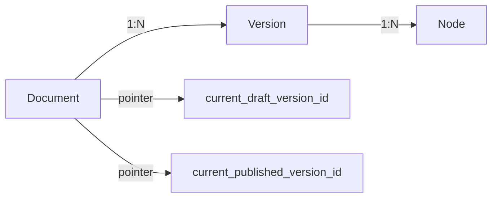
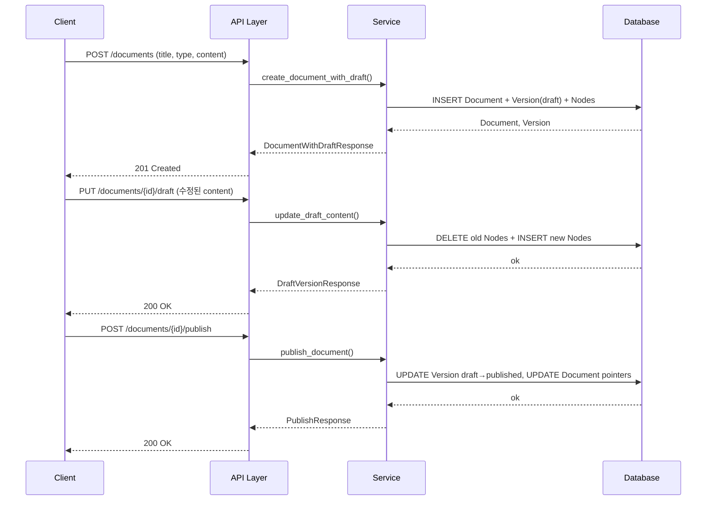
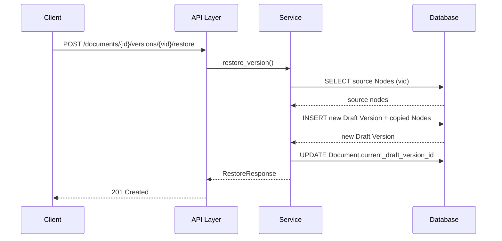

# Phase 4 - Task 4-4. 문서 작성/수정 API 설계

---

## 1. 작업 목적

문서 생성, 수정, Draft 저장, Publish, 버전 조회, 복원, 렌더링 조회 흐름을 API 계약으로 정의한다.  
이 문서는 구현 단계의 라우트/서비스/스키마 설계 기준 문서다.

공통 API 규약 (응답 envelope, pagination, 인증, idempotency)은 Phase 3 기준을 따른다.

---

## 2. API 리소스 모델

### 2-1. 리소스 계층

```
Document                         ← 최상위 리소스
  └─ Version                     ← 하위 리소스 (문서당 N개)
       └─ Node (내부 구조)       ← Version 종속, 별도 엔드포인트
```

### 2-2. 설계 원칙

| 결정 | 내용 |
|------|------|
| 최상위 리소스 | `Document`. 외부에 1차 노출. |
| Version 위치 | `Document` 하위 리소스 (`/documents/{id}/versions/{vid}`). |
| Draft/Published 표현 | 별도 리소스 분리 안 함. `/documents/{id}/draft` 를 현재 Draft 액세스 단축 경로로 사용. |
| 상태 전이 액션 | `publish`, `restore`, `discard`는 RESTful PATCH가 아닌 **명시적 action endpoint** 사용. |
| 조회 기본값 | 모든 기본 조회는 `current_published` 기준. |

### 2-3. 리소스 관계 다이어그램



---

## 3. 엔드포인트 목록

| # | Method | Path | 목적 | 권한 | 감사 |
|---|--------|------|------|------|------|
| 1 | POST | `/api/v1/documents` | 문서 + 초기 Draft 생성 | editor+ | 필요 |
| 2 | GET | `/api/v1/documents` | 문서 목록 조회 | viewer+ | 불필요 |
| 3 | GET | `/api/v1/documents/{id}` | 문서 단건 조회 (published 기준) | viewer+ | 불필요 |
| 4 | PATCH | `/api/v1/documents/{id}` | 문서 메타데이터 수정 | editor+ | 필요 |
| 5 | GET | `/api/v1/documents/{id}/draft` | 현재 Draft 조회 | editor+ | 불필요 |
| 6 | PUT | `/api/v1/documents/{id}/draft` | Draft 본문 전체 저장 | editor+ | 필요 |
| 7 | DELETE | `/api/v1/documents/{id}/draft` | Draft 폐기 (Discard) | editor+ | 필요 |
| 8 | POST | `/api/v1/documents/{id}/publish` | 현재 Draft를 Published로 전환 | publisher+ | 필요 |
| 9 | GET | `/api/v1/documents/{id}/versions` | 버전 목록 조회 | viewer+ | 불필요 |
| 10 | GET | `/api/v1/documents/{id}/versions/{vid}` | 버전 상세 조회 | viewer+ | 불필요 |
| 11 | POST | `/api/v1/documents/{id}/versions/{vid}/restore` | 과거 버전 기반 새 Draft 생성 | editor+ | 필요 |
| 12 | GET | `/api/v1/documents/{id}/render` | 현재 Published 렌더링 조회 | viewer+ | 불필요 |
| 13 | GET | `/api/v1/documents/{id}/versions/{vid}/render` | 특정 버전 렌더링 조회 | viewer+ | 불필요 |

> Phase 3에서 이미 구현된 `POST/GET/PATCH /documents`, `GET /documents/{id}/versions`, `POST /documents/{id}/versions`는 Phase 4에서 재설계/확장된다.  
> 기존 `POST /documents/{id}/versions`는 **Draft 저장 API (PUT /draft)**로 대체한다.

---

## 4. 문서 생성 API

### `POST /api/v1/documents`

**목적:** 새 Document와 초기 Draft Version을 원자적으로 생성한다.

**결정:** 문서 생성 시 초기 Draft를 함께 생성한다.  
빈 Document만 생성하는 2단계 방식은 클라이언트 복잡도를 높이므로 채택하지 않는다.

#### 요청

```json
{
  "title": "개인정보 보호 정책",
  "document_type": "policy",
  "summary": "회사 개인정보 보호 정책 (선택)",
  "metadata": {
    "effective_date": "2026-01-01",
    "owner_department": "법무팀"
  },
  "initial_content": {
    "root": {
      "node_type": "document_root",
      "order_index": 0,
      "children": []
    }
  },
  "change_summary": "최초 작성"
}
```

| 필드 | 필수 | 설명 |
|------|------|------|
| `title` | 필수 | 문서 제목 (1~500자) |
| `document_type` | 필수 | 문서 유형. 생성 후 불변. |
| `summary` | 선택 | 문서 요약 |
| `metadata` | 선택 | 확장 메타데이터 JSONB (64KB 제한) |
| `initial_content` | 선택 | 초기 content_snapshot. 미입력 시 빈 document_root 생성. |
| `change_summary` | 선택 | 초기 Draft 변경 설명 |

#### 응답 (201 Created)

```json
{
  "success": true,
  "request_id": "...",
  "data": {
    "id": "<document-uuid>",
    "title": "개인정보 보호 정책",
    "document_type": "policy",
    "status": "draft",
    "summary": "...",
    "metadata": { ... },
    "current_draft_version_id": "<version-uuid>",
    "current_published_version_id": null,
    "created_by": "<actor-id>",
    "created_at": "2026-04-05T12:00:00Z",
    "updated_at": "2026-04-05T12:00:00Z"
  }
}
```

**권한:** editor 이상  
**Idempotency:** `X-Idempotency-Key` 지원 권장  
**감사 이벤트:** `document.created`, `version.created`

---

## 5. 문서 메타데이터 수정 API

### `PATCH /api/v1/documents/{id}`

**목적:** Document 레벨의 메타데이터(title, summary, metadata)를 수정한다. 본문(Node) 수정과 분리.

**결정:** 메타데이터 수정과 Draft 본문 수정 API를 분리한다 (안 A).

| 안 | 설명 | 채택 근거 |
|----|------|----------|
| **안 A (채택): 분리** | PATCH /documents/{id} = 메타, PUT /draft = 본문 | 책임 명확, 감사 추적 단순 |
| 안 B: 통합 | 한 API에서 메타 + 본문 모두 수정 | UI 편의 높으나 버전 증가 기준 혼란 |

> 메타데이터 수정은 새 Draft Version을 생성하지 않는다.  
> 다만, title 변경 시 현재 Draft Version의 `title_snapshot`도 함께 갱신한다 (Draft가 있는 경우).

#### 요청

```json
{
  "title": "개인정보 보호 정책 v2",
  "summary": "업데이트된 요약",
  "metadata": { "effective_date": "2026-06-01" }
}
```

| 필드 | 설명 |
|------|------|
| `title` | 선택. 변경 시 현재 Draft title_snapshot도 동기화. |
| `summary` | 선택. |
| `metadata` | 선택. 전체 replace 정책. |
| `status` | 선택. `archived`/`deprecated` 전환만 허용 (workflow 전환은 별도 액션). |

#### 응답 (200 OK)

```json
{
  "success": true,
  "data": { /* DocumentResponse */ }
}
```

**권한:** editor 이상  
**감사 이벤트:** `document.metadata_updated`

---

## 6. Draft 저장 API

### `GET /api/v1/documents/{id}/draft`

**목적:** 현재 활성 Draft 상세 조회 (Version + content_snapshot).

#### 응답 (200 OK)

```json
{
  "success": true,
  "data": {
    "version_id": "<uuid>",
    "version_number": 2,
    "status": "draft",
    "label": null,
    "title_snapshot": "...",
    "summary_snapshot": null,
    "metadata_snapshot": { ... },
    "parent_version_id": "<uuid>",
    "restored_from_version_id": null,
    "change_summary": "...",
    "source": "manual",
    "created_by": "<actor-id>",
    "created_at": "...",
    "content": {
      "root": { /* NodeTree */ }
    }
  }
}
```

**권한:** editor 이상  
**에러:** Draft 없으면 `404 Not Found`

---

### `PUT /api/v1/documents/{id}/draft`

**목적:** 현재 Draft의 본문 전체를 교체 저장한다.

**전략:** 요청 content_snapshot으로 기존 Draft의 Node 전체 삭제 후 새 Node 일괄 삽입.

#### 요청

```json
{
  "content": {
    "root": {
      "node_type": "document_root",
      "order_index": 0,
      "children": [
        {
          "node_type": "section",
          "order_index": 0,
          "title": "제1조",
          "children": [
            { "node_type": "paragraph", "order_index": 0, "content": "수정된 내용." }
          ]
        }
      ]
    }
  },
  "change_summary": "제1조 내용 수정",
  "title_snapshot": "개인정보 보호 정책 (선택: 타이틀 스냅샷 갱신)",
  "metadata_snapshot": { "effective_date": "2026-06-01" }
}
```

| 필드 | 필수 | 설명 |
|------|------|------|
| `content` | 필수 | 전체 content_snapshot (Tree JSON). 기존 Node를 대체함. |
| `change_summary` | 선택 | 변경 설명 |
| `title_snapshot` | 선택 | 이 Draft 시점의 제목 스냅샷 갱신 |
| `metadata_snapshot` | 선택 | 이 Draft 시점의 메타데이터 스냅샷 갱신 |

> **내부 처리:** 전체 Node 교체 (삭제 + 재삽입). Version 번호는 증가하지 않음.  
> `content`의 Node `id` 필드: 클라이언트가 제공 시 유지, 미제공 시 서버에서 신규 UUID 발급.

#### 응답 (200 OK)

```json
{
  "success": true,
  "data": {
    "version_id": "...",
    "version_number": 2,
    "status": "draft",
    "content": { "root": { /* 저장된 Tree */ } }
  }
}
```

**권한:** editor 이상  
**에러:** Draft 없으면 `404 Not Found`  
**감사 이벤트:** `version.draft_updated`

---

### `DELETE /api/v1/documents/{id}/draft`

**목적:** 현재 Draft를 폐기 (Discard).

#### 요청 (Request Body, 선택)

```json
{ "discard_reason": "방향 변경으로 폐기" }
```

#### 응답 (200 OK)

```json
{
  "success": true,
  "data": {
    "discarded_version_id": "<uuid>",
    "document_status": "published"
  }
}
```

**권한:** editor 이상 (자신이 생성한 Draft 또는 admin)  
**에러:** Draft 없으면 `404`  
**감사 이벤트:** `version.discarded`

---

## 7. Publish API

### `POST /api/v1/documents/{id}/publish`

**목적:** 현재 Draft를 Published로 전환한다.  
일반 수정(PATCH)이 아닌 **명시적 action endpoint**로 설계한다.

**근거:** Publish는 공식 배포 행위. 권한 분리, 감사 추적, 실패 시 전체 롤백 요구.

#### 요청

```json
{
  "publish_note": "2026 Q2 개정 배포",
  "expected_draft_version_id": "<uuid>"
}
```

| 필드 | 필수 | 설명 |
|------|------|------|
| `publish_note` | 선택 | 발행 메모. `change_summary`에 기록. |
| `expected_draft_version_id` | 선택 | Optimistic check. 전달 시 current_draft와 불일치하면 409 반환. 동시 편집 충돌 방지. |

#### 처리 순서 (원자적)

```
1. current_draft_version_id 존재 확인 (없으면 422)
2. expected_draft_version_id 일치 확인 (불일치 시 409)
3. 권한 확인 (publisher 이상)
4. 기존 Published → superseded (있으면)
5. 현재 Draft → published, published_by = actor, published_at = now()
6. Document.current_published_version_id 갱신
7. Document.current_draft_version_id → NULL
8. Document.status → "published" (최초 발행이면)
9. 감사 이벤트 emit
```

#### 응답 (200 OK)

```json
{
  "success": true,
  "data": {
    "published_version_id": "<uuid>",
    "version_number": 2,
    "published_at": "2026-04-05T12:30:00Z",
    "superseded_version_id": "<uuid-prev>",
    "document_status": "published"
  }
}
```

**권한:** publisher 이상  
**Idempotency:** 권장 (`X-Idempotency-Key`)  
**감사 이벤트:** `version.published`, `version.superseded` (기존 Published 있으면)

---

## 8. 버전 조회 API

### `GET /api/v1/documents/{id}/versions`

**목적:** 문서의 버전 이력 목록 조회.

#### Query Parameters

| 파라미터 | 설명 | 기본값 |
|----------|------|--------|
| `page` | 페이지 번호 | 1 |
| `page_size` | 페이지 크기 (최대 100) | 20 |
| `sort` | 정렬 (`-created_at`, `version_number`) | `-created_at` |
| `status` | 필터 (`draft`, `published`, `superseded`, `discarded`) | 없음 (전체) |

#### 응답

```json
{
  "success": true,
  "data": [
    {
      "id": "<uuid>",
      "version_number": 2,
      "status": "published",
      "label": null,
      "title_snapshot": "개인정보 보호 정책",
      "change_summary": "2026 Q2 개정",
      "source": "manual",
      "parent_version_id": "<uuid>",
      "restored_from_version_id": null,
      "created_by": "<actor>",
      "created_at": "...",
      "published_by": "<actor>",
      "published_at": "..."
    }
  ],
  "meta": {
    "page": 1,
    "page_size": 20,
    "total": 3,
    "has_next": false
  }
}
```

**권한:** viewer 이상 (단, draft/discarded 버전은 editor 이상만 조회)

---

### `GET /api/v1/documents/{id}/versions/{vid}`

**목적:** 특정 버전 상세 조회 (content_snapshot 포함).

#### 응답

```json
{
  "success": true,
  "data": {
    "id": "<uuid>",
    "document_id": "<doc-uuid>",
    "version_number": 1,
    "status": "superseded",
    "label": "v1.0",
    "title_snapshot": "...",
    "summary_snapshot": "...",
    "metadata_snapshot": { ... },
    "parent_version_id": null,
    "restored_from_version_id": null,
    "change_summary": "최초 발행",
    "source": "manual",
    "created_by": "<actor>",
    "created_at": "...",
    "published_by": "<actor>",
    "published_at": "...",
    "content": {
      "root": { /* NodeTree */ }
    }
  }
}
```

**권한:** viewer 이상 (draft/discarded는 editor 이상)

---

## 9. Restore API

### `POST /api/v1/documents/{id}/versions/{vid}/restore`

**목적:** 과거 Version을 기반으로 새 Draft를 생성한다.  
과거 Version을 수정하거나 되살리는 것이 **아니다**.

#### 요청

```json
{
  "restore_note": "v1 내용으로 복원. v2 방향이 부적절하여."
}
```

| 필드 | 필수 | 설명 |
|------|------|------|
| `restore_note` | 선택 | 복원 사유. 새 Draft의 `change_summary`에 기록. |

#### 처리 순서 (원자적)

```
1. source_version 존재 확인
2. Document archived/deprecated 아닌지 확인
3. current_draft_version_id = NULL 확인 (있으면 409)
4. 권한 확인 (editor 이상)
5. source_version의 Node 트리 복사 (새 UUID 발급)
6. 새 Draft Version 생성:
   - version_number: 다음 번호
   - status: "draft"
   - source: "restore"
   - parent_version_id: Document.current_published_version_id
   - restored_from_version_id: vid
   - change_summary: restore_note
7. Document.current_draft_version_id → 새 Draft
8. 감사 이벤트 emit
```

#### 응답 (201 Created)

```json
{
  "success": true,
  "data": {
    "new_draft_version_id": "<uuid>",
    "version_number": 3,
    "restored_from_version_id": "<original-vid>",
    "restored_from_version_number": 1,
    "content": { "root": { /* 복원된 Tree */ } }
  }
}
```

**권한:** editor 이상  
**Idempotency:** 권장  
**에러:**
- `404`: source_version 없음
- `409`: 기존 Draft 존재 (폐기 선행 요구)
- `409`: Document archived/deprecated  
**감사 이벤트:** `version.restored`

---

## 10. 렌더링 조회 API

### 10-1. 설계 결정: 렌더링 전용 엔드포인트 분리 (안 B)

| 안 | 설명 | 채택 근거 |
|----|------|----------|
| 안 A: 일반 조회에 포함 | GET /documents/{id}에 content 포함 | 단순하나 응답 크기 증가 |
| **안 B (채택): 분리** | /render 별도 엔드포인트 | 렌더링 변환 로직 분리, 캐싱 최적화 가능 |

기본 문서 조회(`GET /documents/{id}`)는 Document 메타데이터만 반환한다.  
본문이 필요한 경우 `/render` 또는 `/draft` (편집 시)를 호출한다.

---

### `GET /api/v1/documents/{id}/render`

**목적:** 현재 Published Version을 렌더링 ViewModel 형태로 반환한다.

#### 응답

```json
{
  "success": true,
  "data": {
    "document_id": "<uuid>",
    "version_id": "<uuid>",
    "version_number": 2,
    "title": "개인정보 보호 정책",
    "summary": "...",
    "metadata": { ... },
    "published_at": "...",
    "content": {
      "root": { /* NodeTree ViewModel */ }
    },
    "toc": [
      { "node_id": "n-sec1", "title": "제1조", "level": 1, "order_index": 0 },
      { "node_id": "n-sec2", "title": "제2조", "level": 1, "order_index": 1 }
    ]
  }
}
```

> `toc` (목차) 자동 생성: section/heading 노드에서 추출.  
> ViewModel 변환은 Task 4-7 렌더링 파이프라인에서 상세 정의.

**권한:** viewer 이상  
**에러:** Published 없으면 `404`

---

### `GET /api/v1/documents/{id}/versions/{vid}/render`

**목적:** 특정 Version의 렌더링 ViewModel 반환. 이력 조회, 복원 미리보기 등에 활용.

#### 응답 구조: `/render`와 동일. `version_id`는 요청한 `vid`.

**권한:** viewer 이상 (draft 버전은 editor 이상)

---

## 11. 요청/응답 스키마 초안 요약

### DocumentResponse (GET /documents/{id})

```
id, title, document_type, status, summary, metadata,
current_draft_version_id, current_published_version_id,
created_by, updated_by, created_at, updated_at
```

### VersionSummaryResponse (목록 항목)

```
id, document_id, version_number, status, label,
title_snapshot, change_summary, source,
parent_version_id, restored_from_version_id,
created_by, created_at, published_by, published_at
```

### VersionDetailResponse (상세 / Draft 조회)

```
VersionSummaryResponse + {
  summary_snapshot, metadata_snapshot,
  content: { root: NodeTree }
}
```

### NodeTree (재귀 구조)

```
id, node_type, order_index, title, content, metadata,
children: NodeTree[]
```

### RenderResponse

```
document_id, version_id, version_number, title, summary, metadata,
published_at, content: { root: NodeTree }, toc: TocItem[]
```

### TocItem

```
node_id, title, level, order_index
```

---

## 12. 에러 계약 및 예외 시나리오

| 시나리오 | HTTP Status | 에러 코드 | 재시도 가능 |
|----------|------------|----------|------------|
| 문서 없음 | 404 | `resource_not_found` | 불필요 |
| Draft 없음 (PUT /draft, Publish 등) | 404 또는 422 | `draft_not_found` / `no_draft_to_publish` | 불필요 |
| 기존 Draft 있음 (신규 Draft 생성, Restore) | 409 | `draft_already_exists` | 불필요 (Discard 선행) |
| Publish 가능한 상태 아님 (archived) | 409 | `document_not_publishable` | 불필요 |
| expected_draft_version_id 불일치 | 409 | `optimistic_lock_conflict` | 가능 (재조회 후 재시도) |
| source_version 없음 (Restore) | 404 | `version_not_found` | 불필요 |
| 권한 없음 | 403 | `forbidden` | 불필요 |
| validation 실패 (content 구조 오류) | 422 | `validation_error` | 수정 후 가능 |
| 지원하지 않는 document_type | 422 | `unsupported_document_type` | 불필요 |
| Published 없음 (render 요청) | 404 | `no_published_version` | 불필요 |
| 서버 내부 오류 (트랜잭션 실패) | 500 | `internal_error` | 가능 (idempotency key 활용) |

---

## 13. 권한 / 감사 / Idempotency 포인트

### 13-1. 권한 체크 포인트

| API | 필요 권한 | 체크 수준 |
|-----|----------|----------|
| GET /documents/{id} | viewer | resource 접근 |
| PATCH /documents/{id} | editor | resource 접근 |
| GET /draft | editor | resource + draft 접근 |
| PUT /draft | editor | resource + draft 쓰기 |
| DELETE /draft | editor (본인) / admin | resource + draft 폐기 |
| POST /publish | publisher | resource + 상태 전이 액션 |
| GET /versions | viewer (published), editor (draft/discarded) | resource + status 기반 |
| POST /restore | editor | resource + 복원 액션 |
| GET /render | viewer | resource 접근 (published) |

### 13-2. 감사 이벤트 정의

| 이벤트 타입 | 발생 API | 필수 포함 필드 |
|-------------|----------|---------------|
| `document.created` | POST /documents | document_id, actor_id, document_type |
| `document.metadata_updated` | PATCH /documents/{id} | document_id, actor_id, changed_fields |
| `version.draft_updated` | PUT /draft | document_id, version_id, actor_id |
| `version.discarded` | DELETE /draft | document_id, version_id, actor_id, reason |
| `version.published` | POST /publish | document_id, version_id, actor_id, published_at |
| `version.superseded` | POST /publish (부수 이벤트) | document_id, version_id, superseded_by |
| `version.restored` | POST /restore | document_id, new_version_id, source_version_id, actor_id |

### 13-3. Idempotency 적용 대상

| API | 필요성 | 근거 |
|-----|--------|------|
| `POST /documents` | 높음 | 네트워크 재시도 시 중복 문서 생성 위험 |
| `POST /publish` | 높음 | 중복 발행은 이력에 혼란을 줄 수 있음 |
| `POST /restore` | 중간 | 중복 복원 시 Draft 충돌 409로 자연 방어됨 |
| `PUT /draft` | 낮음 | 동일 content로 재저장은 무해함 |

---

## 14. API 흐름 시퀀스 다이어그램

### 14-1. 신규 문서 작성 → 발행 흐름



### 14-2. 복원 흐름



---

## 15. 권장 API 구조안 및 선택 근거

| 결정 항목 | 채택 | 근거 |
|-----------|------|------|
| 문서 생성 시 초기 Draft 동시 생성 | 채택 | UI 흐름 단순화. 빈 Document 상태 제거. |
| 메타데이터/본문 수정 API 분리 | 채택 | 책임 명확, 버전 증가 기준 정합성 유지. |
| Publish를 action endpoint로 | 채택 | 중요 상태 전이는 명시적 액션으로. 권한/감사/롤백 처리 명확화. |
| Restore를 action endpoint로 | 채택 | "새 Draft 생성" 의미를 API 구조에서 명확히 표현. |
| 렌더링 전용 /render 엔드포인트 | 채택 | 도메인 조회와 렌더링 변환 로직 분리. 캐싱/최적화 기반 확보. |
| Draft 저장은 PUT (전체 교체) | 채택 | 전체 snapshot 저장 전략과 일관성. PATCH보다 의미 명확. |

---

## 16. 후속 작업 영향도

| 후속 Task / Phase | 영향 |
|-------------------|------|
| **Task 4-6 (조회/복원 흐름)** | 버전 목록 필터링, 현재 Draft/Published 구분 조회, Restore 흐름 상세 정책. |
| **Task 4-7 (렌더링 파이프라인)** | `/render` 응답 ViewModel 구조, toc 생성 규칙, content_snapshot → HTML 변환 규칙. |
| **Task 4-8 (권한/감사 연계)** | 이 문서의 권한 포인트 표와 감사 이벤트 정의를 기준으로 enforcement 구현. |
| **구현 (FastAPI routes)** | `documents.py` 라우터 확장 + `draft.py`, `publish.py`, `restore.py` 신규 라우터 또는 actions 서브라우터. |
| **구현 (서비스 레이어)** | `DocumentsService`: create_with_draft, update_metadata. `DraftService`: get, update, discard. `PublishService`: publish. `RestoreService`: restore. |
| **구현 (Pydantic 스키마)** | `DocumentCreateRequest`, `DraftUpdateRequest`, `PublishRequest`, `RestoreRequest`, `VersionDetailResponse`, `RenderResponse`. |
| **Phase 5 (워크플로)** | Publish 앞에 Review/Approve 단계 삽입. `POST /publish` 요청 전 `POST /submit-for-review` 추가. 이번 API 구조와 자연스럽게 연결됨. |
