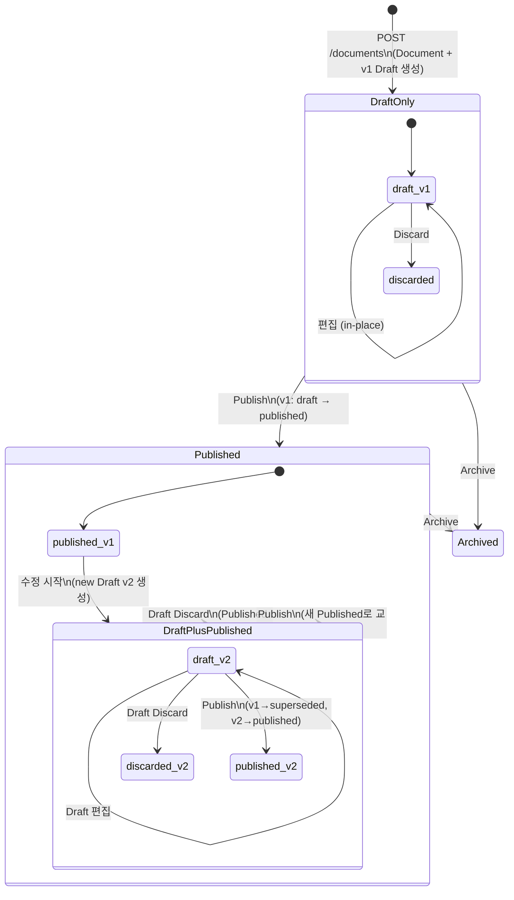

# Phase 4 - Task 4-5. Draft / Published 상태 관리 규칙 설계

---

## 1. 작업 목적

Draft와 Published 상태를 운영 가능한 정책 수준으로 구체화한다.  
이 문서는 Task 4-6, Task 4-7 및 구현 단계의 상태 전이 로직, 권한 체크, 테스트 케이스 설계의 기준 문서다.

---

## 2. Draft / Published 개념 정의

### 2-1. Draft

| 관점 | 정의 |
|------|------|
| **사용자 관점** | 작성자가 작업 중인 미완성 문서 버전. 아직 공식 배포되지 않았다. |
| **시스템 관점** | `Version.status = "draft"`. `Document.current_draft_version_id`가 가리키는 버전. |
| **책임** | 본문 편집, 메타데이터 수정, 노드 구성의 대상. 내용은 언제든 수정 가능. |
| **감사 관점** | 변경 추적의 시작점. Draft가 Publish되면 이 버전이 공식 기록이 된다. |

### 2-2. Published

| 관점 | 정의 |
|------|------|
| **사용자 관점** | 공식 배포된 문서 버전. 모든 조회자가 기본으로 보는 버전. |
| **시스템 관점** | `Version.status = "published"`. `Document.current_published_version_id`가 가리키는 버전. |
| **책임** | 공식 참조 기준 버전. 내용은 불변. 수정하려면 새 Draft를 생성해야 한다. |
| **감사 관점** | 공식 발행 행위 자체가 감사 기록된다. `published_by`, `published_at` 필드에 기록. |

### 2-3. 핵심 차이

| 항목 | Draft | Published |
|------|-------|-----------|
| 내용 수정 가능 여부 | 가능 | 불가 (불변) |
| 일반 사용자 기본 조회 대상 | 아니오 | 예 |
| 문서당 동시 존재 수 | 최대 1개 | 최대 1개 (공식 상태 기준) |
| 발행 전 폐기 가능 여부 | 가능 | 불가 (보관만 가능) |
| 이력으로 남는가 | Discard 후 이력 보존 | superseded 후 이력 보존 |

---

## 3. Draft 보유 정책

### 3-1. 채택안: 문서당 단일 Draft 허용 (안 A)

**결정: 문서당 활성 Draft는 1개만 허용한다.**

| 안 | 설명 | 장점 | 단점 |
|----|------|------|------|
| **안 A: 단일 Draft** | `current_draft_version_id` 포인터 1개. 새 Draft 생성 시 기존 Draft 존재 여부 검사. | 단순, 충돌 없음, 명확한 상태 관리 | 다중 브랜치 편집 불가 |
| 안 B: 다중 Draft | 여러 Draft 동시 존재 허용 | 유연성, 분기 편집 가능 | 복잡도 증가, 충돌 관리 어려움 |

**근거:**
- 이번 Phase의 목표는 핵심 생명주기 구축이다. 다중 Draft는 Phase 5 이후 협업 편집 또는 승인 워크플로 확장 시 도입한다.
- 단일 Draft 정책은 `current_draft_version_id` 포인터 하나로 구현이 단순하며, 상태 충돌 가능성이 없다.

### 3-2. 기존 Draft가 있을 때 새 Draft 생성 요청 처리

| 상황 | 처리 방식 |
|------|----------|
| 활성 Draft 없음 + 새 Draft 생성 요청 | 허용. 새 Draft 생성. |
| 활성 Draft 있음 + 새 Draft 생성 요청 | **거부**. `409 Conflict` 반환. 기존 Draft 폐기 선행 필요. |
| 활성 Draft 없음 + Restore 요청 | 허용. 복원 Draft 생성. |
| 활성 Draft 있음 + Restore 요청 | **거부**. `409 Conflict` 반환. 기존 Draft 폐기 선행 필요. |

---

## 4. Published 보유 정책

**결정: 문서당 현재 공식 Published Version은 1개만 유지한다.**

- `Document.current_published_version_id`가 단일 포인터로 현재 공식 Published를 가리킨다.
- 새 Published 전환 시 기존 Published Version의 status → `superseded`.
- 과거 Published 버전들은 이력으로 보존된다 (삭제 금지).
- "현재 공식 버전"은 항상 `current_published_version_id`가 가리키는 Version이다.

---

## 5. Draft / Published 공존 정책

**결정: Draft와 Published는 동시에 공존할 수 있다.**

이것이 정상적인 편집 흐름이다: Published 문서가 있는 상태에서 수정 작업이 시작되면 두 버전이 공존한다.

| 공존 상황 | Document.status | current_draft | current_published |
|-----------|----------------|---------------|-------------------|
| Draft만 있음 (신규 문서) | `draft` | Draft v1 | NULL |
| Published만 있음 (편집 없음) | `published` | NULL | Published v1 |
| Draft + Published 공존 | `published` | Draft v2 | Published v1 |

### 5-1. 공존 시 조회 기준

| 조회 주체 | 기본 조회 대상 | 명시적 전환 가능 여부 |
|-----------|---------------|---------------------|
| 일반 사용자 (viewer) | `current_published` | 불가 |
| 편집자 (editor) | `current_draft` (편집 컨텍스트), 일반 조회는 `current_published` | 가능 (파라미터로 전환) |
| 관리자 (admin) | 모든 Version 조회 가능 | 가능 |
| API (기본) | `current_published` | `?version_id=...` 또는 `?status=draft`로 전환 |

---

## 6. Publish 전환 시 상태 처리 규칙

### 6-1. 채택안: Draft를 Published 상태로 직접 승격 (안 A)

**결정: Publish 시 별도 Version 생성 없이, 현재 Draft Version의 status를 `published`로 변경한다.**

| 안 | 설명 |
|----|------|
| **안 A (채택)**: Draft 상태 직접 승격 | Draft Version의 status: draft → published |
| 안 B: Publish 시 별도 Published Version 신규 생성 | Draft는 유지되고 새 Published Version 생성 |

안 A 채택 근거: 구현 단순. 하나의 Version 객체가 "이 내용이 발행되었다"는 사실을 직접 표현. 별도 복사가 없어 Node 트리 중복 없음.

### 6-2. Publish 처리 순서 (원자적 처리 필요)

```
1. 선행 조건 검사
   - Document가 존재하고 archived/deprecated가 아닌지 확인
   - current_draft_version_id가 존재하는지 확인
   - 요청자가 publish 권한을 가지는지 확인

2. 기존 Published Version 처리 (있으면)
   - Version[current_published_version_id].status = "superseded"

3. Draft Version 승격
   - Version[current_draft_version_id].status = "published"
   - Version[current_draft_version_id].published_by = actor_id
   - Version[current_draft_version_id].published_at = now()

4. Document 포인터 갱신
   - Document.current_published_version_id = 방금 published된 Version ID
   - Document.current_draft_version_id = NULL
   - Document.status = "published" (최초 발행이면)
   - Document.updated_by = actor_id
   - Document.updated_at = now()

5. 감사 이벤트 emit
   - version.published
   - version.superseded (기존 Published가 있었으면)
```

### 6-3. Publish 실패 시 롤백

- 위 순서는 단일 DB 트랜잭션 내에서 처리되어야 한다.
- 중간 단계 실패 시 트랜잭션 전체 롤백. 어떤 상태도 변하지 않는다.

---

## 7. Draft 폐기(Discard) 정책

### 7-1. Discard의 정의

> Draft Discard = 현재 활성 Draft를 발행하지 않고 명시적으로 포기하는 행위.

Published Version 삭제와 **완전히 다른 개념**이다.

### 7-2. Discard 처리 순서

```
1. 선행 조건: current_draft_version_id가 존재해야 함.
2. Version[current_draft_version_id].status = "discarded"
3. Document.current_draft_version_id = NULL
4. 감사 이벤트: version.discarded
```

### 7-3. Discard 이후 상태

| 상황 | Discard 후 Document 상태 |
|------|--------------------------|
| Published 있음 + Draft Discard | Document.status = `published` 유지 |
| Published 없음 + Draft Discard | Document.status = `draft` 유지 (Published 없으므로) |

> Published 없이 Draft마저 Discard된 문서는 사실상 내용 없는 빈 문서다.  
> 이 경우 문서 전체를 archived 처리하거나, 다시 Draft를 생성해야 한다.

### 7-4. Discarded Draft 복구 가능성

- Discard 처리된 Draft는 이력에 남는다 (status = "discarded").
- 직접 복구(재활성화)는 지원하지 않는다.
- 필요하면 Restore 기능을 통해 해당 Draft Version을 기반으로 새 Draft를 생성하면 된다.

---

## 8. Restore 충돌 정책

### 8-1. 채택안: 기존 Draft가 있으면 Restore 금지 (안 A)

**결정: 활성 Draft가 있을 때 Restore 요청은 거부한다. 기존 Draft 폐기 선행 필요.**

| 안 | 설명 | 장점 | 단점 |
|----|------|------|------|
| **안 A (채택)**: 기존 Draft 있으면 Restore 금지 | 409 오류 반환, Discard 선행 요구 | 명확, 데이터 혼선 없음 | 약간 번거로움 |
| 안 B: Restore 시 기존 Draft 자동 교체 | 기존 Draft 자동 Discard 후 Restore | 편리 | 의도치 않은 Draft 손실 위험 |

안 A 채택 근거: 작성 중인 Draft를 사용자 확인 없이 덮어쓰는 것은 위험하다. 명시적 Discard 후 Restore를 요구하는 것이 데이터 안전성과 사용자 인지 측면에서 더 낫다.

### 8-2. Restore 처리 순서

```
1. 선행 조건 검사
   - source_version_id가 유효한지 확인
   - 대상 Document가 archived/deprecated가 아닌지 확인
   - current_draft_version_id = NULL 인지 확인 (있으면 409 반환)
   - 요청자가 restore 권한 보유 확인

2. 소스 Version의 Node 트리 복사
   - 모든 Node를 새 ID로 복제, version_id = 새 Draft ID로 설정

3. 새 Draft Version 생성
   - version_number: Document 내 다음 번호
   - status: "draft"
   - parent_version_id: Document.current_published_version_id
   - restored_from_version_id: source_version_id
   - source: "restore"

4. Document 포인터 갱신
   - Document.current_draft_version_id = 새 Draft ID

5. 감사 이벤트 emit
   - version.restored (source_version_id 기록)
```

---

## 9. 현재 조회 기준 정책

### 9-1. 역할별 기본 조회 대상

| 조회 주체 | `GET /documents/{id}` 기본 응답 | 다른 버전 조회 방법 |
|-----------|--------------------------------|-------------------|
| **viewer (일반 사용자)** | current_published Version 기준 | 불가 (Published만 접근) |
| **editor (편집자)** | current_published Version 기준 | `?view=draft`로 Draft 조회 가능 |
| **publisher / admin** | current_published Version 기준 | `?view=draft` 또는 `?version_id=...` |
| **API 기본** | current_published Version 기준 | 명시적 파라미터 필요 |

> **원칙: 기본 조회는 항상 current_published 기준.**  
> Draft는 편집 컨텍스트에서만 명시적으로 접근한다.

### 9-2. Published가 없는 문서 조회 정책

| 조회 주체 | 처리 |
|-----------|------|
| viewer | `404 Not Found` 또는 `403 Forbidden` (Published 없는 문서는 공개 조회 불가) |
| editor / admin | Draft 조회 가능 (`?view=draft` 파라미터 또는 전용 Draft 조회 엔드포인트) |

---

## 10. 상태별 허용/금지 행위 표

| 현재 상태 | 수행 행위 | 허용 여부 | 수행 주체 조건 | 결과 상태 | 비고 |
|-----------|-----------|-----------|---------------|-----------|------|
| Draft only | Draft 편집 | 허용 | editor 이상 | Draft only (유지) | Node in-place 갱신 |
| Draft only | Draft 폐기 | 허용 | editor 이상 | Draft only (Draft 없음) | discarded 처리 |
| Draft only | Publish | 허용 | publisher 이상 | Published | Document.status → published |
| Draft only | Restore | 금지 | - | - | 기존 Draft 있음 |
| Draft only | 일반 조회 | 금지 | - | - | Published 없음 |
| Draft only | 메타데이터 수정 | 허용 | editor 이상 | Draft only (유지) | Document 레벨 변경 |
| Published | Draft 생성 (수정 시작) | 허용 | editor 이상 | Draft + Published | 새 Draft Version 생성 |
| Published | 일반 조회 | 허용 | viewer 이상 | - | current_published 기준 |
| Published | Publish (Draft 없이) | 금지 | - | - | 발행할 Draft 없음 |
| Published | Published 직접 수정 | 금지 | - | - | Published 불변 원칙 |
| Published | 보관(Archive) | 허용 | admin | Archived | |
| Published | Restore | 허용 | editor 이상 | Draft + Published | current_draft가 NULL일 때만 |
| Draft + Published | Draft 편집 | 허용 | editor 이상 | Draft + Published (유지) | |
| Draft + Published | Draft 폐기 | 허용 | editor 이상 | Published only | Draft discarded |
| Draft + Published | Publish | 허용 | publisher 이상 | Published (교체) | 기존 Published superseded |
| Draft + Published | 일반 조회 | 허용 | viewer 이상 | - | current_published 기준 |
| Draft + Published | Restore | 금지 | - | - | 기존 Draft 있음 |
| Archived | 모든 편집/발행 | 금지 | - | - | 보관 해제 선행 필요 |
| Archived | 이력 조회 | 허용 | viewer 이상 | - | |
| Archived | 보관 해제 | 허용 | admin | 이전 상태 복귀 | |

---

## 11. 권한별 상태 전이 제한

| 역할 | 조회 (published) | 조회 (draft) | Draft 생성/편집 | Publish | Restore | Draft 폐기 | Archive |
|------|----------------|--------------|----------------|---------|---------|------------|---------|
| **viewer** | 가능 | 불가 | 불가 | 불가 | 불가 | 불가 | 불가 |
| **editor** | 가능 | 가능 | 가능 | 불가 | 가능 | 가능 (자신 Draft) | 불가 |
| **publisher** | 가능 | 가능 | 가능 | 가능 | 가능 | 가능 | 불가 |
| **admin** | 가능 | 가능 | 가능 | 가능 | 가능 | 가능 | 가능 |

> 이 권한 체계는 Phase 2 ACL 설계 기반이다. 실제 enforcement는 Phase 4 구현 단계에서 `authorization_service`와 연결한다.

---

## 12. 예외 및 충돌 시나리오

| 시나리오 | 처리 정책 | HTTP 응답 | 감사 필요 |
|----------|----------|-----------|----------|
| Draft 없이 Publish 요청 | 거부 | `422 Unprocessable Entity` | 불필요 |
| Published 없이 viewer 조회 | 거부 | `404 Not Found` | 불필요 |
| 기존 Draft 있을 때 새 Draft 생성 | 거부 | `409 Conflict` | 불필요 |
| 기존 Draft 있을 때 Restore 요청 | 거부 | `409 Conflict` | 불필요 |
| discarded Draft에 대한 편집 요청 | 거부 | `404 Not Found` (current draft 없음) | 불필요 |
| Archived 문서에 Publish 요청 | 거부 | `409 Conflict` | 불필요 |
| 권한 없는 사용자의 Publish 요청 | 거부 | `403 Forbidden` | 필요 (보안 이벤트) |
| 권한 없는 사용자의 Draft 조회 | 거부 | `403 Forbidden` | 필요 (보안 이벤트) |
| Publish 중 트랜잭션 실패 | 전체 롤백 | `500 Internal Server Error` | 필요 (시스템 이벤트) |

---

## 13. 권장 운영 정책안 (요약)

| 정책 항목 | 결정 |
|-----------|------|
| **Draft 개수** | 문서당 활성 Draft 최대 1개 |
| **Published 개수** | 문서당 현재 공식 Published 최대 1개 |
| **Draft/Published 공존** | 허용. 정상적인 편집 흐름. |
| **Publish 시 기존 Published 처리** | 기존 Published → `superseded` 상태로 자동 전환. 이력 보존. |
| **Publish 방식** | Draft status를 `published`로 직접 승격 (별도 Version 생성 안 함). |
| **Restore 충돌 정책** | 기존 Draft가 있으면 Restore 금지. Discard 선행 요구. |
| **기본 조회 기준** | 항상 current_published Version. Draft는 명시적 접근만 허용. |
| **Published 없는 문서 조회** | viewer에게 404 반환. editor 이상은 `?view=draft`로 접근. |
| **Draft 폐기** | 명시적 Discard 액션. status → `discarded`. 이력 보존. |
| **핵심 권한 분리** | 조회(viewer), 편집(editor), 발행(publisher), 전체(admin) |

---

## 14. Mermaid 상태 전이 다이어그램



---

## 15. 후속 작업 영향도

| 후속 Task | 영향 |
|-----------|------|
| **Task 4-6 (조회/복원 흐름)** | current_published 기준 조회 API, `?view=draft` 파라미터, Restore API 설계 기준. |
| **Task 4-7 (렌더링 파이프라인)** | 렌더링 입력은 항상 published 상태 Version. Draft 렌더링은 preview 개념으로 별도 처리. |
| **구현 (서비스 로직)** | Publish 시 트랜잭션 원자성 필수. single active draft 제약 DB 레벨 또는 서비스 레벨 구현. |
| **구현 (API 예외)** | 409 Conflict (Draft 충돌), 422 (Publish할 Draft 없음), 403 (권한 부족) 에러 케이스 모두 명시적 처리. |
| **Phase 5 (승인 워크플로)** | 현재 단일 Draft 정책이 승인 흐름과 자연스럽게 연결됨. 승인 상태는 Version.status 확장이나 별도 ApprovalRequest 엔티티로 추가 가능. |
