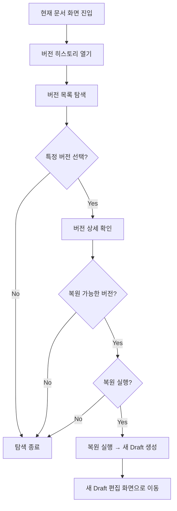
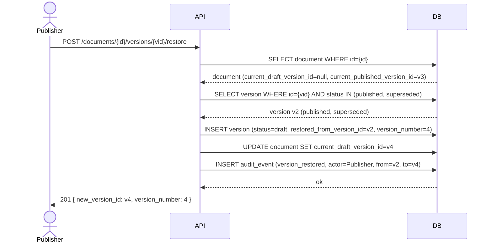

# Task 4-6: 버전 조회, 이력 탐색, 복원 흐름 설계

## 1. 작업 목적

Phase 4의 버전 탐색 및 복원 흐름을 정의한다. 이 문서는 Task 4-1(생명주기), Task 4-2(Version 모델), Task 4-4(API 설계), Task 4-5(Draft/Published 운영 정책)를 실제 조회·복원 흐름으로 연결하는 기준 문서다.

- 사용자가 문서 변경 이력을 안전하게 탐색하고 원하는 시점으로 돌아갈 수 있는 구조 정의
- 현재 문서 상태 조회와 과거 버전 이력 조회를 명확히 분리
- 복원 기능이 이력 무결성을 훼손하지 않도록 조회·복원의 책임 경계 명확화
- 이후 diff 비교, 감사 추적 강화, 승인 이력 확장으로 자연스럽게 이어지는 탐색 구조 마련

---

## 2. 버전 탐색 기본 사용자 흐름

버전 탐색은 7단계 흐름으로 이루어진다.



### 단계별 정의

| 단계 | 사용자 목적 | 시스템 제공 정보 | 다음 단계 조건 | 권한 차이 |
|------|------------|----------------|--------------|----------|
| 1. 현재 문서 진입 | 현재 공식 버전 확인 | current_published 또는 current_draft 표시 | 항상 가능 | viewer는 published만, editor+는 draft 포함 |
| 2. 버전 히스토리 열기 | 변경 이력 파악 | 버전 목록 API 호출 | 항상 가능 | viewer는 published 이력만 |
| 3. 버전 목록 탐색 | 특정 시점 파악 | version_number, status, created_at, change_summary | 스크롤/pagination | viewer: published만, editor+: draft 포함 |
| 4. 특정 버전 선택 | 해당 시점 내용 확인 | 버전 상세 조회 API 호출 | 클릭 가능한 버전 | 접근 권한 있는 버전만 |
| 5. 버전 상세 확인 | 내용, 이력, lineage 파악 | 메타 + 본문 구조 + lineage + 복원 가능 여부 | 항상 제공 | content_snapshot: editor+ |
| 6. 복원 가능 여부 판단 | 복원할지 결정 | can_restore 플래그 + 충돌 여부 + 경고 | can_restore=true인 경우만 | publisher+ 역할 보유 시 |
| 7. 복원 실행 또는 종료 | 새 Draft 생성 또는 탐색 종료 | 복원 결과 (새 Draft ID, 경고) | 복원 가능 + 충돌 없을 때 | publisher+ |

---

## 3. 버전 목록 조회 흐름

### 3.1 기본 정렬 기준

- **기본 정렬**: `version_number DESC` (최신 버전이 상단)
- **대안 정렬**: `created_at DESC` (생성 시간 기준, 향후 지원)
- published 버전 우선 정렬은 기본 제공하지 않음 (필터로 분리)

### 3.2 상태 필터링

| 필터 | 기본 제공 대상 | 비고 |
|------|--------------|------|
| status=all | editor+만 접근 가능 | draft 포함 전체 이력 |
| status=published | viewer 기본 뷰 | published + superseded 포함 |
| is_current_draft=true | editor+만 | 현재 활성 draft 단건 |
| is_current_published=true | 전체 | 현재 공식 발행본 단건 |

### 3.3 Pagination

- 기본 `page_size=20`, 최대 100
- cursor 기반 pagination은 Phase 5에서 검토 (현재는 offset 기반)
- 버전 수가 적은 MVP 단계에서는 전체 반환도 허용 (max 100개)

### 3.4 목록 요약 필드

버전 목록 응답의 각 항목은 다음 필드를 포함한다:

```json
{
  "version_id": "uuid",
  "version_number": 3,
  "status": "published",
  "is_current_published": true,
  "is_current_draft": false,
  "created_at": "2026-01-15T10:00:00Z",
  "created_by": "user-123",
  "published_at": "2026-01-15T11:00:00Z",
  "published_by": "user-456",
  "restored_from_version_id": null,
  "change_summary": "1분기 규정 개정 반영",
  "can_restore": true
}
```

**can_restore 계산 규칙**: 응답 생성 시점에 요청자 권한 + 현재 문서 상태를 고려해 동적 계산 (상세는 §6 참조).

### 3.5 Current Draft / Published 표시 방식

목록 상단에 핀(pin) 형식으로 현재 활성 버전 2종을 표시한다:

```
[현재 Published] v3 — 1분기 규정 개정 반영 (2026-01-15 발행)
[현재 Draft]     v4 — 작업 중 (수정 중, 2026-02-01 생성)
--- 이하 이력 ---
v3  published  ...
v2  superseded ...
v1  superseded ...
```

API 레벨에서는 `pinned_versions` 배열 + `history_versions` 배열로 분리하거나, 단일 배열에 `is_pinned` 플래그를 포함한다. MVP에서는 단일 배열 + is_current_* 플래그 방식을 채택한다.

---

## 4. 버전 상세 조회 흐름

### 4.1 상세 조회 응답 구조

버전 상세는 다음 6개 정보 영역으로 구성된다:

```json
{
  "version_id": "uuid",
  "document_id": "uuid",

  "meta": {
    "version_number": 3,
    "label": "1분기 개정판",
    "change_summary": "1분기 규정 개정 반영",
    "created_at": "2026-01-15T10:00:00Z",
    "created_by": "user-123",
    "source": "manual"
  },

  "status": {
    "value": "published",
    "is_current_published": true,
    "is_current_draft": false
  },

  "lineage": {
    "parent_version_id": "uuid-of-v2",
    "restored_from_version_id": null
  },

  "publish_info": {
    "published_at": "2026-01-15T11:00:00Z",
    "published_by": "user-456"
  },

  "snapshot": {
    "title_snapshot": "개인정보 처리방침",
    "summary_snapshot": "2026년 1분기 기준 개정본",
    "metadata_snapshot": {},
    "content_snapshot": { ... }
  },

  "actions": {
    "can_restore": true,
    "restore_blocked_reason": null
  }
}
```

### 4.2 content_snapshot 제공 범위

- **기본**: 상세 조회 시 `content_snapshot` 전체 포함
- **렌더링 분리**: 도메인 상세 조회(이 API)와 렌더링 ViewModel 조회는 **별도 엔드포인트**로 분리
  - `GET /documents/{id}/versions/{vid}` → 도메인 상세 (본 문서)
  - `GET /documents/{id}/versions/{vid}/render` → 렌더링 ViewModel (Task 4-7)
- content_snapshot이 크면 별도 요청으로 분리할 수 있도록 `include_content=false` 쿼리 파라미터 지원 (기본 true)

### 4.3 actions 필드

상세 응답에 `actions` 섹션을 포함해 클라이언트가 UI 버튼 상태를 결정할 수 있게 한다:

| 필드 | 타입 | 설명 |
|------|------|------|
| can_restore | bool | 요청자 기준 복원 가능 여부 |
| restore_blocked_reason | str? | 불가 이유 (`"active_draft_exists"`, `"insufficient_permission"`, `"invalid_status"` 등) |

---

## 5. 현재 문서 조회와 특정 버전 조회 구분

### 5.1 두 흐름의 의미

| 구분 | 현재 문서 조회 | 특정 버전 조회 |
|------|--------------|--------------|
| 목적 | 지금 이 문서는 어떤 상태인가 | 그 시점 버전은 어떤 내용이었나 |
| 기준 | current_published 또는 current_draft 포인터 | version_id로 직접 지정 |
| 불변성 | 포인터가 바뀌면 응답도 바뀜 | 버전은 불변 — 항상 같은 내용 |
| URL | `GET /documents/{id}` | `GET /documents/{id}/versions/{vid}` |
| 주 사용자 | 일반 열람 | 이력 검토, 복원 판단 |

### 5.2 권장안: 별도 흐름 분리 (안 A)

**안 A (채택)**를 권장한다.

- `GET /documents/{id}`: 현재 문서 상태 조회. `?view=published` (기본) 또는 `?view=draft` 파라미터로 어떤 포인터를 사용할지 결정
- `GET /documents/{id}/versions`: 버전 목록 (이력 탐색 진입점)
- `GET /documents/{id}/versions/{vid}`: 특정 버전 불변 스냅샷 조회

안 B(파라미터로 구분)는 단순해 보이나 "현재 상태"와 "과거 스냅샷"의 의미론적 구분이 흐려지고, 클라이언트가 캐싱 전략을 세우기 어렵다. 불변 버전은 강하게 캐시하고 현재 문서는 짧게 캐시하는 전략을 취할 수 없게 된다.

### 5.3 응답 차이

| 항목 | 현재 문서 응답 | 버전 상세 응답 |
|------|--------------|--------------|
| id | document_id | version_id |
| 내용 | 현재 포인터의 snapshot | 해당 버전 snapshot |
| is_current_* 플래그 | 항상 true (요청 view 기준) | 계산된 값 |
| actions | edit, publish 등 | restore |
| Cache-Control | 짧은 TTL | 긴 TTL (불변) |

---

## 6. 버전 상태 표시 규칙

### 6.1 상태값과 사용자 표시 라벨

| DB status | is_current_published | is_current_draft | 사용자 표시 라벨 | 한국어 표시 |
|-----------|---------------------|-----------------|----------------|-----------|
| draft | false | true | Current Draft | 작업 중 |
| draft | false | false | Old Draft / Discarded | 폐기된 초안 |
| published | true | false | Current Published | 현재 공식 |
| published | false | false | Past Published | 과거 발행본 |
| superseded | false | false | Superseded | 이전 버전 |
| discarded | false | false | Discarded | 폐기됨 |

### 6.2 목록용 vs 상세용 표시

- **목록용**: `status_label` 문자열 + `is_current_published` / `is_current_draft` 불리언 플래그
- **상세용**: 전체 상태 객체 (`status.value` + `is_current_*` + 이유)
- 클라이언트는 두 플래그를 조합해 뱃지 색상 등 UI를 결정

### 6.3 복원에서 파생된 버전 표시

`restored_from_version_id`가 있는 경우 목록에 "복원됨 (v{N} 기준)" 부가 표시를 노출한다.

---

## 7. 복원 가능 여부 판단 규칙

### 7.1 기본 정책: 안정성 우선 (안 A 채택)

복원 대상은 **published 상태 버전** 및 **superseded 상태 버전**으로 제한한다. 이유:

- Published/Superseded는 정식 발행 단계를 거친 검증된 내용
- Draft/Discarded는 미완성 내용 — 복원 시 의미 없는 작업 상태를 기준으로 되돌리는 혼선 방지
- 운영 규정 문서 플랫폼에서는 "검증된 과거 상태로의 복귀" 개념이 안전

### 7.2 복원 가능 여부 매트릭스

| 버전 status | 현재 Active Draft 없음 | 현재 Active Draft 있음 |
|------------|----------------------|----------------------|
| draft (current) | 불가 (현재 Draft = 직접 편집) | - |
| draft (old/discarded) | 불가 | 불가 |
| published (current) | 가능* | 불가 (409) |
| published (past/superseded) | 가능 | 불가 (409) |
| discarded | 불가 | 불가 |

*current_published의 복원은 의미가 약하나 기술적으로 허용 (새 Draft 생성 = 재편집 시작)

### 7.3 권한별 복원 가능 범위

| 역할 | 복원 가능 여부 |
|------|-------------|
| viewer | 불가 |
| editor | 불가 (Draft 작성만 가능) |
| publisher | 가능 |
| admin | 가능 |

### 7.4 문서 상태별 복원 가능 여부

| 문서 status | 복원 허용 |
|------------|----------|
| active | 허용 |
| archived | 불가 (문서 비활성 상태) |
| deprecated | 불가 |

---

## 8. 복원 실행 전 확인 정보

클라이언트가 사용자에게 복원 확인 다이얼로그를 표시할 때 필요한 정보 정의.

### 8.1 필수 확인 정보

| 항목 | 출처 | 표시 목적 |
|------|------|---------|
| 복원 대상 version_number | 버전 상세 | "v{N}을 기준으로 복원합니다" |
| created_at | 버전 상세 | 해당 버전의 작성 시점 |
| created_by | 버전 상세 | 누가 작성했는지 |
| published_at | 버전 상세 | 정식 발행 시점 확인 |
| change_summary | 버전 상세 | 해당 버전의 변경 설명 |
| restored_from_version_id | 버전 상세 | 이미 복원된 버전인지 여부 |
| current_draft_exists | 문서 현재 상태 | 기존 작업 중 Draft가 있는지 경고 |
| restore_result_description | 시스템 | "새 Draft v{N+1}이 생성됩니다" |

### 8.2 경고 표시 기준

- `current_draft_exists = true`: 복원 불가 상태이므로 에러 메시지 + 복원 버튼 비활성화
- `restored_from_version_id != null`: "이 버전은 이미 복원을 통해 생성된 버전입니다" 안내

### 8.3 Precheck API

복원 실행 전 클라이언트가 상태를 확인할 수 있는 precheck 정보를 버전 상세 응답의 `actions` 섹션에서 제공 (별도 API 불필요):

```json
"actions": {
  "can_restore": false,
  "restore_blocked_reason": "active_draft_exists",
  "restore_preview": {
    "new_version_number": 5,
    "source_version_number": 3,
    "current_draft_version_id": "uuid-of-v4"
  }
}
```

---

## 9. 복원 결과 흐름

### 9.1 복원 후 생성되는 객체

복원 = `POST /documents/{id}/versions/{vid}/restore` 실행 시:

1. 새 Version 행 생성
   - `status = draft`
   - `version_number = max_existing + 1`
   - `source = "restore"`
   - `restored_from_version_id = {vid}` (복원 출처)
   - `parent_version_id = current_published.id` (현재 공식 발행 버전 기준)
   - content_snapshot = 복원 대상 버전의 content_snapshot 복사
   - title_snapshot, summary_snapshot, metadata_snapshot 복사

2. Document 테이블 업데이트
   - `current_draft_version_id = new_version.id`
   - `current_published_version_id` → **변경 없음** (기존 발행본 유지)

### 9.2 복원 시퀀스 다이어그램



### 9.3 복원 후 상태 요약

| 항목 | 복원 전 | 복원 후 |
|------|--------|--------|
| current_published_version_id | v3 | v3 (유지) |
| current_draft_version_id | null | v4 (새 Draft) |
| 버전 목록 | v1, v2, v3 | v1, v2, v3, v4 |
| v4.status | - | draft |
| v4.restored_from_version_id | - | v2 |

### 9.4 복원 후 사용자 이동

복원 성공 시 클라이언트는 새 Draft 편집 화면으로 이동한다:
- URL 예시: `/documents/{id}/edit` (current_draft 기준)
- 또는 `/documents/{id}/versions/{new_vid}` (버전 상세 뷰)

---

## 10. 복원 충돌 및 예외 시나리오

| 시나리오 | 허용/금지 | 처리 정책 | HTTP 상태 | 감사 이벤트 |
|---------|---------|---------|---------|-----------|
| 기존 Draft 있는 상태에서 Restore 요청 | 금지 | 409 반환, `active_draft_exists` 사유 포함 | 409 Conflict | state_transition_denied (실패) |
| 복원 대상 version_id 존재하지 않음 | 금지 | 404 반환 | 404 Not Found | 없음 |
| 권한 없는 복원 요청 (editor 이하) | 금지 | 403 반환 | 403 Forbidden | access_denied |
| archived / deprecated 문서 복원 | 금지 | 409 반환, `document_not_active` 사유 | 409 Conflict | state_transition_denied |
| draft / discarded 버전 복원 시도 | 금지 | 422 반환, `invalid_version_status` 사유 | 422 Unprocessable | state_transition_denied |
| 동일 버전 중복 복원 (active draft 없을 때) | 허용 | 새 Draft 또는 같은 내용의 Draft 재생성 가능 | 201 Created | version_restored |
| 복원 직후 즉시 Publish | 허용 | 복원으로 생성된 Draft → Publish 가능 (별도 요청) | 200 OK | document_published |
| 복원 중 DB 오류 | - | 트랜잭션 롤백, 500 반환 | 500 Internal | system_error (내부 로그) |

---

## 11. 권한별 조회/복원 범위

| 역할 | 버전 목록 조회 | Draft 포함 조회 | Published 이력 조회 | content_snapshot 조회 | 복원 실행 | 복원 결과 Draft 접근 |
|------|-------------|--------------|-------------------|---------------------|---------|-------------------|
| viewer | published 이력만 | 불가 | 가능 | 가능 (published) | 불가 | 불가 |
| editor | 전체 목록 | 가능 | 가능 | 가능 (모든 버전) | 불가 | 가능 (자신이 작성한 경우) |
| publisher | 전체 목록 | 가능 | 가능 | 가능 (모든 버전) | 가능 | 가능 |
| admin | 전체 목록 | 가능 | 가능 | 가능 (모든 버전) | 가능 | 가능 |

**viewer의 Draft 비노출 이유**: Draft는 미완성 내용으로 규정 문서 플랫폼에서 외부 노출 시 혼선 야기.

---

## 12. 감사 추적 연계

### 12.1 버전 탐색/복원 관련 감사 이벤트

| 이벤트 타입 | 발생 시점 | 필수 기록 필드 |
|-----------|---------|-------------|
| `version_list_accessed` | (선택) 버전 목록 조회 | actor_id, document_id, occurred_at |
| `version_detail_accessed` | (선택) 버전 상세 조회 | actor_id, document_id, version_id |
| `version_restored` | 복원 성공 | actor_id, document_id, from_version_id, new_version_id, occurred_at |
| `state_transition_denied` | 복원/발행 거부 | actor_id, document_id, attempted_action, reason, occurred_at |
| `access_denied` | 권한 없는 접근 | actor_id, document_id, version_id, occurred_at |

**조회 이벤트(version_list_accessed, version_detail_accessed)**: MVP에서는 선택 사항 (과도한 로그 방지). 보안 감사가 필요한 경우 활성화.

### 12.2 change_summary vs audit_event 분리

| 항목 | change_summary | audit_event |
|------|---------------|-------------|
| 작성 주체 | 사용자 (편집자/발행자) | 시스템 자동 기록 |
| 목적 | 변경 이유/내용 설명 (human-readable) | 누가/언제/무엇을 했는지 추적 (machine-readable) |
| 수정 가능 여부 | 제한적 허용 (MVP는 불변) | 불변 |
| 노출 대상 | 버전 목록/상세 UI | 감사 로그 화면, 관리자 도구 |

### 12.3 UI 버전 이력에서의 감사 정보 표시

버전 목록 UI에서 다음 수준만 표시:
- 버전 번호, 작성자, 작성 시각
- 발행자, 발행 시각 (published인 경우)
- change_summary

상세 감사 로그(access_denied, state_transition_denied 등)는 별도 감사 화면에서만 노출.

---

## 13. 권장 탐색/복원 정책안 (요약)

### 확정 결정사항

| 항목 | 결정 |
|------|------|
| 버전 목록 기본 정렬 | `version_number DESC` (최신순) |
| 목록 요약 필드 | version_number, status, is_current_published, is_current_draft, created_at, created_by, published_at, change_summary, can_restore |
| 상세 조회 범위 | 메타 + 상태 + lineage + publish_info + content_snapshot (기본 포함) + actions |
| 현재 문서 vs 버전 조회 구분 | 별도 URL 분리 (안 A): `/documents/{id}` vs `/documents/{id}/versions/{vid}` |
| 복원 가능 버전 범위 | published + superseded 상태만 허용 |
| 기존 Draft 존재 시 복원 정책 | 409 반환, 복원 불가 (먼저 Draft 폐기 필요) |
| 복원 결과 상태 | 새 Draft 생성, `restored_from_version_id` 기록, current_published 유지 |
| 역할별 기본 접근 범위 | viewer: published만 / editor+: 전체 목록 / publisher+: 복원 가능 |
| 렌더링과 도메인 상세 분리 | 별도 엔드포인트 (`/versions/{vid}` vs `/versions/{vid}/render`) |

### 핵심 원칙 요약

1. **현재 상태 ≠ 과거 이력**: URL과 응답 구조로 명확히 구분
2. **복원 = 새 Draft 생성**: 과거 버전은 불변, 복원은 신규 작업 흐름 시작
3. **Active Draft 단수 원칙**: 기존 Draft 있으면 복원 불가 (충돌 방지)
4. **안정성 우선**: published/superseded 버전만 복원 허용
5. **감사와 UI 이력 분리**: change_summary(사용자 작성) vs audit_event(시스템 기록)

---

## 14. 후속 작업 영향도

| 후속 작업 | 이 문서의 영향 |
|---------|-------------|
| Task 4-7 렌더링 파이프라인 | 버전 상세 `/versions/{vid}/render` 엔드포인트가 도메인 상세와 분리됨 |
| Task 4-8 권한/감사 설계 | §11 권한 매트릭스, §12 감사 이벤트 목록이 기준 |
| Task 4-9 MVP 범위 | 복원 흐름 전체(조회→판단→실행)가 MVP에 포함 |
| 구현: 버전 조회 서비스 | 목록 필드, 정렬, 필터, is_current_* 계산 로직 |
| 구현: 복원 서비스 | §9 복원 결과 흐름, §10 예외 처리가 구현 기준 |
| 구현: 테스트 설계 | §10 예외 시나리오 전체가 테스트 케이스 후보 |
| 향후 diff 기능 | 버전 상세에 `parent_version_id` 포함 → diff 계산 출발점 확보 |
