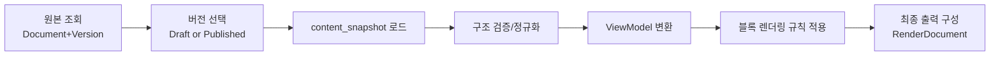
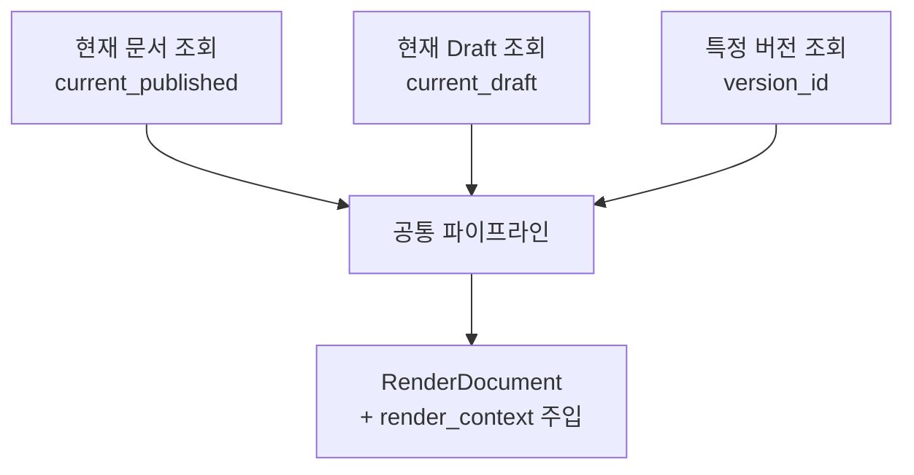
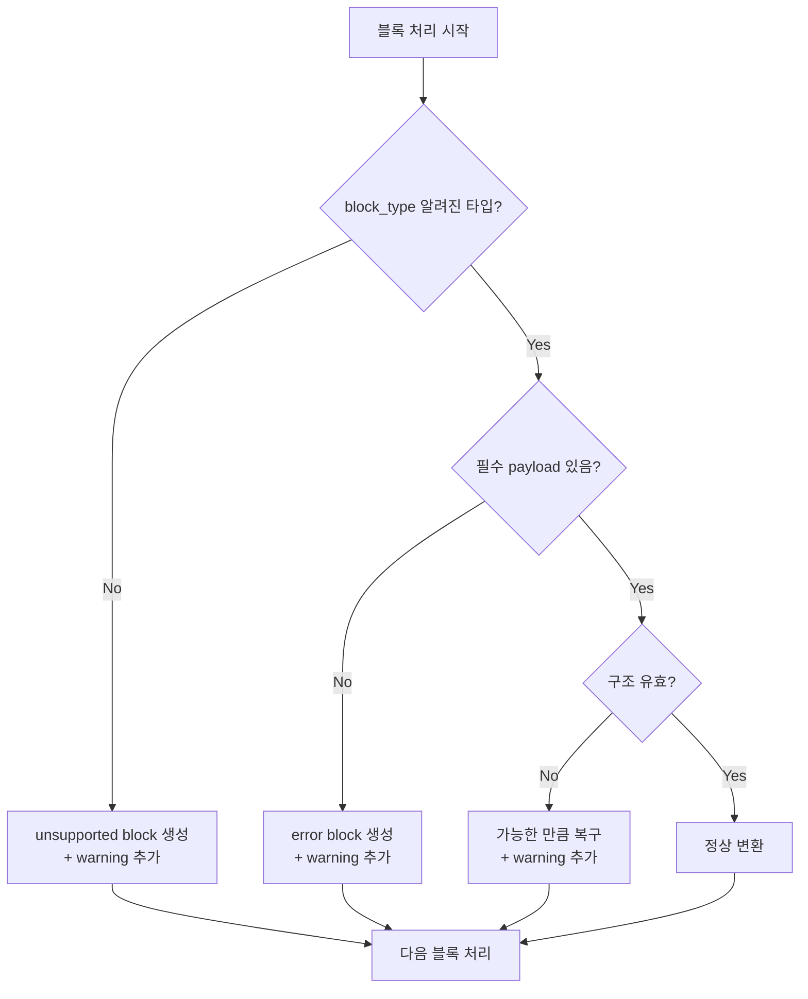

# Task 4-7: 렌더링 파이프라인 기초 설계

## 1. 작업 목적

문서 플랫폼에 저장된 문서 구조를 사용자가 읽을 수 있는 화면 표현으로 안정적으로 변환하는 렌더링 파이프라인의 기초 구조를 설계한다.

- Task 4-3 저장 구조와 Task 4-6 조회 흐름을 실제 표시 가능한 구조로 연결
- 저장 포맷과 렌더링 포맷의 책임을 분리하여 UI 종속성 최소화
- 현재 문서, 특정 버전, Draft, Published를 동일한 렌더링 규약 위에서 표현
- diff 비교, export(PDF/HTML), AI 요약 뷰로 확장 가능한 변환 구조 마련
- 이상 데이터·미지원 블록에 대한 부분 복구 전략으로 플랫폼 안정성 확보

---

## 2. 렌더링 파이프라인 단계 정의

렌더링은 **조회 모델을 표시 모델로 변환하는 파이프라인**이다. 단순 화면 출력이 아니라, 저장 구조와 표시 구조의 책임을 분리하는 변환 계층이다.



### 단계별 정의

| 단계 | 입력 | 출력 | 책임 | 실패 가능 지점 |
|------|------|------|------|-------------|
| 1. 원본 조회 | document_id, version 파라미터 | Document + Version row | DB 조회, 권한 확인 | 문서 없음, 권한 없음 |
| 2. 버전 선택 | `view=draft\|published` or `version_id` | 단일 Version 선택 | current_draft 또는 current_published 포인터 역할 | 포인터 null, 버전 없음 |
| 3. content_snapshot 로드 | version_id | content_snapshot JSON | DB 컬럼 또는 Node rows에서 트리 재조립 | JSON 파싱 실패, Node rows 손상 |
| 4. 구조 검증/정규화 | content_snapshot | 정규화된 NodeTree | 필수 필드 보완, unknown type 감지, 순서 정렬 | 치명적 구조 손상 |
| 5. ViewModel 변환 | 정규화된 NodeTree + Version 메타 | RenderDocument | 타입별 ViewModel 매핑, TOC 파생 생성, 경고 수집 | 없음 (fallback으로 흡수) |
| 6. 블록 렌더링 규칙 적용 | RenderDocument | 렌더링 규칙이 적용된 블록 트리 | 블록별 표시 방식 결정, 상태 배지 주입 | 없음 (fallback block) |
| 7. 최종 출력 구성 | 블록 트리 + 메타 | API 응답 JSON | 헤더, TOC, 블록, 경고 조합 | 없음 |

---

## 3. 렌더링 입력 모델 비교 및 권장안

### 3.1 세 가지 방향 비교

| 구분 | 안 A: content_snapshot 직접 사용 | 안 B: 중간 입력 모델 | 안 C (채택): 정규화 후 ViewModel 변환 |
|------|--------------------------------|-------------------|--------------------------------------|
| 단순성 | 높음 | 중간 | 낮음 (단계 많음) |
| 저장↔UI 결합도 | 높음 (저장 구조 변경 시 UI 영향) | 중간 | 낮음 |
| 오류 복구 | 어려움 | 중간 | 쉬움 (각 단계에서 fallback) |
| 재사용성 | 낮음 | 중간 | 높음 (현재/과거 버전 공통 파이프라인) |
| 확장성 | 낮음 | 중간 | 높음 (diff/export/AI summary 재사용 가능) |

### 3.2 권장안: 안 C 채택

**content_snapshot을 1차 정규화 후 ViewModel로 변환**한다.

- **1차 정규화**: unknown type 감지, 필수 필드 보완, 순서 정렬 → 안정적인 NodeTree 확보
- **ViewModel 변환**: NodeTree를 렌더링 목적의 블록 트리로 변환, TOC 파생, 경고 수집
- **현재/과거 공통**: 동일 파이프라인 재사용, `render_context`(상태 배지 등)만 주입 차이

---

## 4. 렌더링 ViewModel 기본 구조

### 4.1 최상위 RenderDocument

```json
{
  "source_document_id": "uuid",
  "source_version_id": "uuid",
  "source_version_number": 3,
  "render_mode": "published",
  "title": "개인정보 처리방침",
  "summary": "2026년 1분기 기준 개정본",
  "status_badge": {
    "label": "현재 공식",
    "type": "current_published"
  },
  "toc": [
    { "block_id": "heading-1", "level": 1, "text": "제1조 목적", "anchor": "s1" },
    { "block_id": "heading-2", "level": 2, "text": "1.1 적용 범위", "anchor": "s1-1" }
  ],
  "blocks": [ ... ],
  "warnings": [],
  "unsupported_blocks": []
}
```

### 4.2 RenderBlock 단위 구조

```json
{
  "block_id": "node-uuid",
  "block_type": "heading",
  "display_role": "section_title",
  "order": 1,
  "heading_level": 1,
  "content": "제1조 목적",
  "children": [],
  "annotations": [],
  "warnings": []
}
```

### 4.3 필드 정의표

| 필드 | 필수 | 생성 시점 | 목적 | UI 의존 여부 |
|------|------|---------|------|-----------|
| source_document_id | 필수 | 원본 조회 | 문서 역추적 | No |
| source_version_id | 필수 | 버전 선택 | 버전 역추적, 캐시 키 | No |
| render_mode | 필수 | 파이프라인 입력 | draft/published/version 구분 | 약함 |
| title | 필수 | Version.title_snapshot | 표시 제목 | No |
| toc | 선택 | ViewModel 변환 단계 파생 | 목차 | UI 사용 |
| blocks | 필수 | ViewModel 변환 단계 | 표시 내용 | No |
| status_badge | 선택 | render_context 주입 | 상태 표시 | UI 사용 |
| warnings | 선택 | 각 변환 단계 수집 | fallback 발생 알림 | 운영/UI |
| unsupported_blocks | 선택 | 정규화/변환 단계 | 미지원 블록 목록 | 운영 |

---

## 5. 최소 렌더링 블록 타입 정의

MVP에서 지원하는 블록 타입:

| block_type | 의미 | Node 대응 | 중첩 가능 | fallback 필요 |
|-----------|------|---------|---------|------------|
| `document` | 문서 루트 | root node | Yes | No |
| `section` | 논리적 섹션 | section node | Yes (중첩 section) | No (빈 section 허용) |
| `heading` | 제목 (h1~h6) | heading node | No | Yes (레벨 이상 시) |
| `paragraph` | 일반 문단 | paragraph node | No | No |
| `list` | 목록 컨테이너 | list node | No (list_item 자식만) | No |
| `list_item` | 목록 항목 | list_item node | Yes (중첩 list) | No |
| `table` | 표 | table node | No | Yes (구조 손상 시) |
| `quote` | 인용문 | quote node | No | No |
| `appendix` | 부록 | appendix node | Yes | No |
| `unsupported` | 미지원 블록 fallback | 미지원 node_type | No | - |
| `error` | 손상 블록 fallback | 필수 필드 누락 | No | - |

---

## 6. 블록별 렌더링 규칙

### 6.1 Heading

- `heading_level` (1~6) 그대로 h1~h6에 대응
- `heading_level`이 없거나 범위 초과 시 → `level=2` fallback + warning
- 빈 텍스트 heading → `[제목 없음]` placeholder + warning
- `heading_level=1,2`인 경우만 TOC에 포함 (기본; 설정 가능)
- section anchor = `"s" + heading.block_id` 형태로 파생 생성

### 6.2 Paragraph

- 텍스트 내용 그대로 표시. 서식 정보(bold, italic 등)는 `annotations` 배열에 위치
- 빈 문단 → 렌더링에서 제거 (공백 문단은 운영자 경고 없이 무시)
- 줄바꿈: `\n` 은 `<br>`로 처리; 연속 공백은 단일 공백으로 정규화

### 6.3 Section

- 섹션 경계는 시각적 구분선 또는 들여쓰기로 표현 (UI 결정)
- 하위 블록 순서: `order_index` 기준 오름차순
- `section` 자체 title 없는 경우: 첫 번째 `heading` 자식을 대표 제목으로 간주
- 빈 section(자식 없음) → 렌더링 생략 + 운영자 경고

### 6.4 List / List_Item

- `list.metadata.ordered = true` → 숫자 목록, `false` → 불릿 목록
- `list_item` 안에 `list` 자식이 있으면 중첩 목록 (최대 3 depth 권장)
- 빈 `list_item` → `[항목 없음]` placeholder + warning (silent)

### 6.5 Table

- `table.metadata.rows[]` 배열 구조를 행/열로 변환
- 빈 셀 → 빈 문자열 표시 (에러 아님)
- `rows` 배열이 비어 있거나 `cols` 불일치 시 → `error` block fallback + warning

### 6.6 Appendix / Reference

- 본문 블록 영역(`blocks`) 이후 별도 `appendix_blocks` 섹션으로 배치
- 부록 번호화: `appendix` 순서에 따라 "부록 A", "부록 B" 자동 부여
- `reference` 블록은 현재 MVP에서는 `paragraph`로 fallback 처리

---

## 7. 문서 레이아웃 기본 구성

렌더링된 문서는 다음 순서로 구성된다:

```
┌────────────────────────────────────┐
│ 1. 문서 헤더                        │
│    - 문서 제목 (title)              │
│    - 상태 배지 (Draft / Published)  │
│    - 버전 번호 + 발행일              │
├────────────────────────────────────┤
│ 2. 요약 영역 (summary, optional)   │
├────────────────────────────────────┤
│ 3. 목차 (toc, optional)            │
├────────────────────────────────────┤
│ 4. 본문 블록 영역 (blocks)          │
│    section > heading/paragraph/... │
├────────────────────────────────────┤
│ 5. 부록 영역 (appendix_blocks)     │
├────────────────────────────────────┤
│ 6. 경고/복구 정보 영역 (warnings)   │
│    (UI에서 숨김 가능, 운영자용)      │
└────────────────────────────────────┘
```

**상태 배지 위치**: 문서 헤더에 항상 포함. Draft는 "작업 중" 배지로 눈에 띄게 표시.

**읽기 모드 vs 편집 미리보기 모드**: 동일한 ViewModel 구조를 공유. 편집 모드에서는 `render_mode="draft"` + 편집 UI 오버레이 추가.

---

## 8. 목차 및 파생 정보 생성 규칙

### 8.1 권장안: 렌더링 단계에서 파생 생성 (안 B 채택)

목차를 저장 구조(content_snapshot)에 포함하지 않고 **렌더링 단계에서 heading 블록을 순회해 파생 생성**한다.

| 항목 | 결정 | 이유 |
|------|------|------|
| 목차 저장 여부 | 저장 안 함 | heading 변경 시 목차 동기화 문제 방지 |
| 목차 생성 시점 | ViewModel 변환 단계 | 저장 구조 단순화 |
| TOC 포함 기준 | heading_level 1~2 (기본) | 과도한 목차 방지 |
| section anchor | `block_id` 기반 자동 생성 | 고유성 보장 |

### 8.2 파생 생성 항목 목록

| 파생 정보 | 생성 기준 | 저장 여부 |
|---------|---------|---------|
| TOC | heading 블록 순회 | No |
| section anchor | block_id | No |
| appendix 번호 | appendix 순서 | No |
| warnings 목록 | 정규화+변환 단계 수집 | No (응답에만 포함) |
| 문단 수 / 섹션 수 | (향후 선택 기능) | No |

---

## 9. 현재 문서 렌더링과 특정 버전 렌더링 관계

### 9.1 공통 파이프라인

Draft와 Published, 현재 문서와 특정 과거 버전 모두 **동일한 렌더링 파이프라인**을 통과한다. 차이는 `render_context` 주입값뿐이다.



### 9.2 render_context 주입 차이

| 조회 유형 | render_mode | status_badge | 편집 허용 | immutable 표시 |
|---------|------------|-------------|---------|-------------|
| 현재 Published | `published` | "현재 공식" (green) | No | No |
| 현재 Draft | `draft` | "작업 중" (yellow) | Yes | No |
| 과거 버전 (published) | `version` | "과거 발행본 v{N}" (gray) | No | Yes |
| 과거 버전 (superseded) | `version` | "이전 버전 v{N}" (gray) | No | Yes |

### 9.3 Draft 렌더링 허용 범위

- Draft는 미완성 구조(빈 section, 임시 제목 등) 포함 가능 → 더 관대한 정규화 적용
- Draft 렌더링 시 `warnings`에 미완성 블록 목록 포함 (사용자에게 표시)
- Published는 엄격한 정규화 적용 (필수 필드 누락 시 error block)

---

## 10. 렌더링 실패 및 Fallback 정책

### 10.1 기본 원칙: 부분 복구 우선

전체 렌더링 실패보다 **손상된 블록을 fallback으로 교체하고 나머지를 정상 렌더링**한다.



### 10.2 시나리오별 처리 정책

| 시나리오 | 감지 시점 | 렌더링 중단? | Fallback | 경고 표시 | 로그 |
|---------|---------|-----------|---------|---------|------|
| 알 수 없는 block_type | 정규화 단계 | No | `unsupported` block | 운영자용 | Warning |
| 필수 payload 누락 | ViewModel 변환 | No | `error` block | 운영자용 | Error |
| table 구조 손상 (rows 불일치) | ViewModel 변환 | No | `error` block (표 전체) | 사용자+운영자 | Error |
| heading_level 범위 초과 | 정규화 단계 | No | level=2 보정 | 운영자용 | Warning |
| 루트 구조 누락 (content_snapshot null) | content_snapshot 로드 | **Yes** | 404/500 반환 | - | Error |
| section 내 비허용 자식 | 정규화 단계 | No | 자식 재배치 + warning | 운영자용 | Warning |
| content_snapshot JSON 파싱 실패 | content_snapshot 로드 | **Yes** | 500 반환 | - | Error |

**렌더링 중단(전체 실패) 조건**: content_snapshot 자체를 로드할 수 없는 경우만.

---

## 11. 렌더링 응답 모델과 API 연계

### 11.1 도메인 조회 vs 렌더링 조회 분리

| 구분 | 도메인 조회 | 렌더링 조회 |
|------|-----------|-----------|
| URL | `GET /documents/{id}/versions/{vid}` | `GET /documents/{id}/versions/{vid}/render` |
| 목적 | 버전 메타, lineage, 복원 판단 | 화면 표시용 ViewModel |
| 내용 | DB 필드 그대로 | 변환된 RenderDocument |
| Cache | 불변 버전: 장기 캐시 | Published: 장기 캐시, Draft: no-cache |
| 소비자 | 이력 관리 UI, 복원 흐름 | 문서 뷰어, 프리뷰 |

현재 문서 렌더링: `GET /documents/{id}/render?view=published|draft`

### 11.2 렌더링 응답 최상위 구조

```json
{
  "source_document_id": "uuid",
  "source_version_id": "uuid",
  "source_version_number": 3,
  "render_mode": "published",
  "title": "개인정보 처리방침",
  "summary": "2026년 1분기 기준 개정본",
  "status_badge": {
    "label": "현재 공식",
    "type": "current_published"
  },
  "toc": [
    { "block_id": "h1", "level": 1, "text": "제1조 목적", "anchor": "h1" }
  ],
  "blocks": [ ... ],
  "appendix_blocks": [ ... ],
  "warnings": [],
  "unsupported_blocks": []
}
```

### 11.3 render_mode 값

| render_mode | 의미 |
|------------|------|
| `published` | 현재 공식 발행본 |
| `draft` | 현재 작업 중 Draft |
| `version` | 특정 과거 버전 (immutable) |

### 11.4 가공 수준

렌더링 응답은 **UI가 직접 소비할 수 있는 수준**까지 가공한다:
- TOC 완성본 포함
- 상태 배지 텍스트/타입 포함
- anchor 완성본 포함
- warnings 집계 포함

---

## 12. 성능 및 확장 고려사항

| 항목 | 고려사항 |
|------|---------|
| 대형 문서 | blocks 배열이 크면 `include_content=false` + 별도 블록 페이지 로딩 고려 (Phase 5+) |
| 목차/파생 정보 캐싱 | Published 버전 렌더링은 불변 → CDN 또는 Redis 캐시 가능 |
| Draft 캐싱 | Draft는 자주 바뀌므로 캐시 금지 (Cache-Control: no-store) |
| 렌더링 비용 | Published >> Draft (Draft는 더 관대한 처리 + warning 수집) |
| diff 뷰 확장 | 두 버전의 blocks 배열을 비교하는 diff 파이프라인이 본 ViewModel 구조를 재사용 |
| export 확장 | `RenderDocument`를 입력으로 받아 PDF/HTML 생성 가능 |
| AI 요약 확장 | `blocks`의 `content` 필드를 추출해 텍스트 파이프라인에 전달 가능 |

---

## 13. 최소 예시 변환 흐름

### 예시 1: 제목 + 문단 2개

**입력 content_snapshot 요약**:
```json
{
  "type": "document",
  "children": [
    { "type": "heading", "level": 1, "text": "제1조 목적" },
    { "type": "paragraph", "text": "본 방침은..." },
    { "type": "paragraph", "text": "적용 범위는..." }
  ]
}
```

**변환 후 RenderDocument 요약**:
```json
{
  "title": "개인정보 처리방침",
  "toc": [{ "level": 1, "text": "제1조 목적", "anchor": "h1" }],
  "blocks": [
    { "block_type": "heading", "heading_level": 1, "content": "제1조 목적" },
    { "block_type": "paragraph", "content": "본 방침은..." },
    { "block_type": "paragraph", "content": "적용 범위는..." }
  ],
  "warnings": []
}
```

---

### 예시 2: section 2개 + heading 구조

**입력 요약**:
```json
{
  "type": "document",
  "children": [
    { "type": "section", "children": [
      { "type": "heading", "level": 1, "text": "제1조" },
      { "type": "paragraph", "text": "..." }
    ]},
    { "type": "section", "children": [
      { "type": "heading", "level": 1, "text": "제2조" },
      { "type": "paragraph", "text": "..." }
    ]}
  ]
}
```

**변환 후 요약**:
- `toc`: 2개 항목 (제1조, 제2조)
- `blocks`: section × 2 각각 heading + paragraph 포함
- `warnings`: []

---

### 예시 3: table 포함 문서

**입력 요약**:
```json
{ "type": "table", "metadata": { "rows": [
  ["항목", "내용"],
  ["수집 항목", "이름, 이메일"]
]}}
```

**변환 후**:
```json
{
  "block_type": "table",
  "table_model": {
    "headers": ["항목", "내용"],
    "rows": [["수집 항목", "이름, 이메일"]]
  },
  "warnings": []
}
```

---

### 예시 4: unsupported block 포함 문서

**입력 요약**:
```json
{ "type": "custom_widget", "payload": { "widget_id": "xyz" } }
```

**변환 후**:
```json
{
  "block_type": "unsupported",
  "original_type": "custom_widget",
  "warnings": [{ "level": "warn", "message": "Unsupported block type: custom_widget" }]
}
```

`RenderDocument.unsupported_blocks`: `["custom_widget"]` 추가됨.

---

## 14. 후속 작업 영향도

| 후속 작업 | 이 문서의 영향 |
|---------|-------------|
| Task 4-8 권한/감사 | render API 접근 권한 (viewer: published만, editor+: draft 포함) |
| Task 4-9 MVP 범위 | published 렌더링이 MVP 핵심; draft 렌더링은 편집 미리보기로 포함 |
| 구현: render API | §11 응답 구조가 기준. `/render` 엔드포인트 2종 구현 |
| 구현: ViewModel 서비스 | §4~§8 정의가 서비스 로직 기준 |
| 구현: fallback 처리 | §10 시나리오 전체가 테스트 케이스 후보 |
| 향후 diff 뷰 | 두 ViewModel의 `blocks` 배열 비교로 구현 가능 |
| 향후 PDF export | `RenderDocument`를 입력으로 받는 exporter 플러그인 추가 |
| 향후 AI 요약 | `blocks[].content` 추출 파이프라인 추가 |
