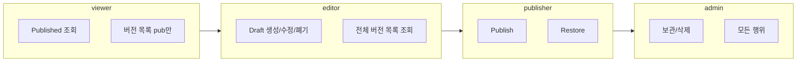
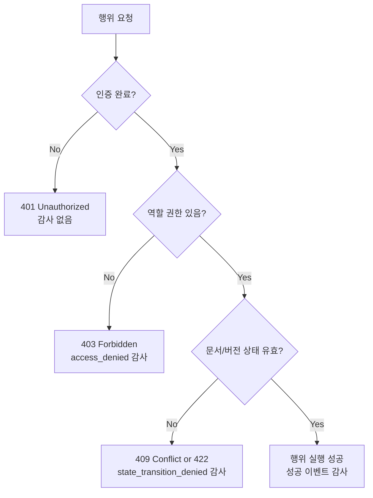

# Task 4-8: 권한/감사 연계 설계

## 1. 작업 목적

문서 작성/수정/발행/복원/조회 행위를 기존 권한 체계 및 감사 추적 체계와 안정적으로 연결하는 정책과 구조를 설계한다.

- Phase 2 역할/권한/감사 원칙을 Phase 4 문서 생명주기와 직접 연결
- 핵심 행위별 "누가 무엇을 할 수 있는지" 명확한 기준 정의
- Draft/Published/Restore 흐름에서 민감한 상태 전이 포인트 통제
- 구현 단계의 API 권한 검사, 서비스 레벨 enforcement, audit event 기록 기준선 마련
- "누가, 언제, 무엇을, 어떤 근거로" 변경했는지 추적 가능한 최소 기록 모델 정리

---

## 2. 문서 행위별 권한 포인트 분해

문서 플랫폼에서 권한 검사가 필요한 모든 행위를 "CRUD"가 아닌 **상태 전이 + 운영 행위** 중심으로 분해한다.

| 행위 | 대상 리소스 | 민감도 | 권한 검사 위치 | 감사 이벤트 |
|------|-----------|--------|-------------|-----------|
| 문서 생성 | Document | 중간 | API + Service | 필수 (`document_created`) |
| 문서 메타 조회 | Document | 낮음 | API | 선택 |
| 문서 메타 수정 | Document | 중간 | API + Service | 필수 (`document_metadata_updated`) |
| 현재 Published 조회 | Document + Version | 낮음 | API | 선택 |
| 현재 Draft 조회 | Version (draft) | 중간 | API + Service | 선택 |
| Draft 생성 | Version | 중간 | API + Service | 필수 (`draft_created`) |
| Draft 수정 (PUT /draft) | Version + Nodes | 중간 | API + Service | 필수 (`draft_updated`) |
| Draft 폐기 | Version | 중간 | API + Service | 필수 (`draft_discarded`) |
| **Publish** | Document + Version | **높음** | API + Service | 필수 (`document_published`) |
| 버전 목록 조회 | Version[] | 낮음~중간 | API | 선택 |
| 버전 상세 메타 조회 | Version | 낮음~중간 | API | 선택 |
| 버전 content_snapshot 조회 | Version | 중간 | API + Service | 선택 |
| 렌더링 조회 | Version (render) | 낮음~중간 | API | 선택 |
| **Restore** | Document + Version | **높음** | API + Service | 필수 (`version_restored`) |
| 문서 보관/삭제 | Document | **높음** | API + Service | 필수 (`document_archived`) |

**권한 검사 위치 원칙**:
- "API만": 빠른 반환, 캐시 활용 가능
- "API + Service": 민감 행위는 서비스 레이어에서 이중 검증 (API 우회 경로 방어)

---

## 3. 작성 권한 / 발행 권한 분리

### 3.1 두 안 비교

| 관점 | 안 A: 분리 (채택) | 안 B: 통합 |
|------|----------------|----------|
| 보안 통제 | 높음 (Publish 진입 장벽) | 낮음 |
| 운영 단순성 | 낮음 (역할 관리 필요) | 높음 |
| 승인 워크플로 확장성 | 높음 (publisher 역할이 확장 지점) | 낮음 |
| 감사 추적 | 명확 (작성자 ≠ 발행자 분리 기록) | 불명확 |
| 조직 규모 대응 | 대/중 조직에 적합 | 소규모 팀에 적합 |

### 3.2 권장안: 안 A 채택

**editor는 Draft 생성/수정/폐기까지, Publish는 publisher 이상으로 제한한다.**

근거:
- 규정 문서 플랫폼 특성상 문서 공식화는 책임 있는 주체가 수행해야 함
- 작성자와 발행자를 분리하면 `published_by` 필드가 감사 증빙으로서 의미를 가짐
- 이후 승인 워크플로(editor → reviewer → publisher)로 확장 시 현재 분리가 자연스러운 기반

---

## 4. 버전 조회 권한 범위

| 조회 유형 | viewer | editor | publisher | admin |
|---------|--------|--------|-----------|-------|
| 현재 Published 조회 | O | O | O | O |
| 현재 Draft 조회 | X | O | O | O |
| 버전 목록 (published만) | O | O | O | O |
| 버전 목록 (Draft 포함) | X | O | O | O |
| 버전 상세 메타 (published) | O | O | O | O |
| 버전 상세 메타 (draft/discarded) | X | O | O | O |
| content_snapshot (published) | O | O | O | O |
| content_snapshot (draft) | X | O | O | O |
| 렌더링 (published) | O | O | O | O |
| 렌더링 (draft) | X | O | O | O |
| 폐기 Draft 이력 | X | X | O | O |
| 복원 가능 여부 정보 | X | X (조회만 가능) | O | O |

**viewer의 Draft 비노출 이유**: 미완성·미검토 내용을 규정으로 오인할 수 있음.

**동일 문서라도 공개 범위 차등**: 향후 `document.visibility` 필드를 통해 조직 내/외부 접근 차등 허용 가능. MVP에서는 단일 visibility(internal).

---

## 5. 복원 권한 정의

### 5.1 두 안 비교

| 항목 | 안 A: publisher 이상 (채택) | 안 B: editor도 허용 |
|------|--------------------------|------------------|
| 통제 수준 | 높음 | 낮음 |
| 복원 남용 방지 | 쉬움 | 어려움 |
| 편집자 자율성 | 낮음 | 높음 |
| 감사 추적 명확성 | 높음 (발행 권한 = 복원 권한) | 낮음 |

### 5.2 권장안: 안 A (publisher 이상)

**복원 = 새 Draft 생성이지만, 과거 내용을 공식 흐름에 재진입시키는 행위** → Publish와 같은 책임 수준 필요.

- editor는 복원 불가 (복원 결과 Draft를 publish할 수 없으므로 단독 복원 의미 없음)
- publisher는 복원 + 복원 결과 Draft Publish 가능
- admin은 복원 + 모든 조작 가능

---

## 6. 권한 연계 표 (역할 × 행위 매트릭스)

| 행위 | viewer | editor | publisher | admin | 조건 | 감사 이벤트 |
|------|:------:|:------:|:---------:|:-----:|------|-----------|
| 문서 생성 | X | O | O | O | - | `document_created` |
| 문서 메타 조회 | O | O | O | O | - | - |
| 문서 메타 수정 | X | O | O | O | - | `document_metadata_updated` |
| 현재 Published 조회 | O | O | O | O | - | - |
| 현재 Draft 조회 | X | O | O | O | Active Draft 존재 시 | - |
| Draft 생성 | X | O | O | O | Active Draft 없을 때 | `draft_created` |
| Draft 수정 | X | O | O | O | Active Draft 존재 | `draft_updated` |
| Draft 폐기 | X | O* | O | O | Active Draft 존재 / *본인 draft만 | `draft_discarded` |
| **Publish** | X | X | O | O | Active Draft 존재 | `document_published` |
| 버전 목록 조회 | O (pub만) | O (전체) | O (전체) | O (전체) | - | - |
| 버전 상세 조회 | O (pub만) | O (전체) | O (전체) | O (전체) | - | - |
| 렌더링 조회 | O (pub만) | O (전체) | O (전체) | O (전체) | - | - |
| **Restore** | X | X | O | O | No active draft | `version_restored` |
| 문서 보관 | X | X | X | O | - | `document_archived` |



---

## 7. 감사 이벤트 분류 체계

핵심 이벤트를 사후 추적·운영 통제에 필요한 최소 집합으로 정의한다.

| 이벤트 타입 | 의미 | 발생 조건 | 성공/실패 구분 | 사용자 이력 표시 |
|-----------|------|---------|-------------|--------------|
| `document_created` | 문서 생성 | POST /documents 성공 | 성공만 | O |
| `document_metadata_updated` | 문서 메타 수정 | PATCH /documents/{id} 성공 | 성공만 | O |
| `draft_created` | Draft 생성 | PUT /draft → 최초 Draft 생성 | 성공만 | O |
| `draft_updated` | Draft 본문 수정 | PUT /draft → 기존 Draft 교체 | 성공만 | O (선택) |
| `draft_discarded` | Draft 폐기 | DELETE /draft 성공 | 성공만 | O |
| `document_published` | 문서 발행 | POST /publish 성공 | **성공+실패** | O |
| `version_restored` | 버전 복원 | POST /restore 성공 | **성공+실패** | O |
| `access_denied` | 권한 거부 | 403 반환 | 실패만 | X (감사만) |
| `state_transition_denied` | 상태 전이 거부 | 409/422 반환 (민감 행위) | 실패만 | X (감사만) |
| `document_archived` | 문서 보관 | 보관 처리 성공 | 성공만 | O |

**draft_updated 빈도**: 저장 버튼 누를 때마다 기록하면 과도 → MVP에서는 "마지막 저장" 기준 단건 또는 배치 처리 고려.

---

## 8. 감사 이벤트 최소 필드 구조

모든 감사 이벤트의 공통 필드:

```json
{
  "event_id": "uuid-v4",
  "event_type": "document_published",
  "occurred_at": "2026-01-15T11:00:00Z",
  "actor_user_id": "user-456",
  "actor_role": "publisher",
  "document_id": "doc-uuid",
  "version_id": "version-uuid",
  "target_version_id": null,
  "previous_state": "draft",
  "new_state": "published",
  "action_result": "success",
  "reason": null,
  "request_id": "req-abc-123"
}
```

### 8.1 필드별 정의

| 필드 | 필수 | 목적 | 민감정보 |
|------|------|------|---------|
| event_id | 필수 | 이벤트 고유 식별 | No |
| event_type | 필수 | 이벤트 분류 | No |
| occurred_at | 필수 | 발생 시각 (UTC) | No |
| actor_user_id | 필수 | 행위 주체 식별 | 간접 개인정보 |
| actor_role | 필수 | 권한 컨텍스트 | No |
| document_id | 필수 | 대상 문서 | No |
| version_id | 조건부 | 관련 버전 (없으면 null) | No |
| target_version_id | 조건부 | restore 시 복원 대상 | No |
| previous_state | 조건부 | 상태 전이 전 상태 | No |
| new_state | 조건부 | 상태 전이 후 상태 | No |
| action_result | 필수 | `success` / `failure` | No |
| reason | 선택 | 실패 이유 코드 | No |
| request_id | 필수 | HTTP 요청 추적 (correlation) | No |

**source_ip / client_info**: MVP에서는 선택 사항 (과도한 개인정보 수집 방지). 보안 요구사항 증가 시 추가.

**최소 재구성 가능 조건**: `actor` + `occurred_at` + `document_id` + `version_id` + `previous_state` + `new_state` + `action_result`로 "누가, 언제, 무엇을, 어떤 상태에서 변경했는지" 재구성 가능.

---

## 9. 변경 기록 구조 정의

사용자 관점 이력과 시스템 감사 로그를 명확히 분리한다.

| 계층 | 이름 | 작성 주체 | 목적 | 변경 가능 여부 |
|------|------|---------|------|-------------|
| 1 | `Version.change_summary` | 사용자 (편집자/발행자) | 이번 버전에서 무엇을 바꿨는지 설명 | 제한적 허용 (MVP: 불변) |
| 2 | 사용자용 변경 이력 (UI) | 시스템 (audit_event 기반) | 버전 목록에 표시되는 간략 이력 | 불변 |
| 3 | `audit_event` 테이블 | 시스템 자동 기록 | 누가/언제/무엇을/어떤 결과로 | 불변 |

```
┌──────────────────────────────────────┐
│  사용자 화면 이력 (Version 목록)        │
│  - version_number                    │
│  - status                            │
│  - created_by / published_by         │
│  - change_summary (사용자 작성)       │
│  ← audit_event에서 파생 가능하나 별도 │
├──────────────────────────────────────┤
│  내부 감사 로그 (audit_event 테이블)   │
│  - event_type, actor, before/after   │
│  - access_denied, state_denied 등    │
│  ← 사용자에게 직접 노출 안 함          │
└──────────────────────────────────────┘
```

**차이점 요약**:
- `change_summary`: 사용자가 설명한 변경 의도 → 버전 이력 UI에 표시
- `audit_event`: 시스템이 자동 기록한 사실 → 운영자 추적, 보안 감사에 사용
- 두 데이터는 동일한 저장소를 공유하지 않는 것을 원칙으로 한다

---

## 10. 성공/실패 행위의 감사 기록 정책

### 10.1 두 안 비교

| 항목 | 안 A: 성공만 | 안 B: 민감 행위 실패도 기록 (채택) |
|------|-----------|--------------------------------|
| 로그 단순성 | 높음 | 중간 |
| 보안 추적성 | 낮음 | 높음 |
| 공격 패턴 감지 | 불가 | 가능 |
| 로그 볼륨 | 낮음 | 중간 |

### 10.2 권장안: 안 B (민감 행위 실패 기록)

**모든 실패를 기록하지 않고, 아래 민감 행위의 실패만 기록한다**:

| 실패 시나리오 | 기록 여부 | 이벤트 타입 |
|------------|---------|-----------|
| Publish 권한 없음 | O | `access_denied` |
| Publish 상태 불일치 | O | `state_transition_denied` |
| Restore 권한 없음 | O | `access_denied` |
| Restore 상태 불일치 (Draft 존재 등) | O | `state_transition_denied` |
| 권한 없는 Draft 조회 | O | `access_denied` |
| 존재하지 않는 버전 조회 | X (404, 로그 불필요) | - |
| 메타 수정 권한 없음 | O | `access_denied` |
| 일반 조회 권한 없음 | X (빈번, 과도한 로그) | - |

---

## 11. 권한 실패와 상태 실패의 구분



| 실패 유형 | 분류 | HTTP | 감사 이벤트 | 운영자 표시 |
|---------|------|------|-----------|-----------|
| 역할/권한 없음 | 권한 실패 | 403 | `access_denied` | "권한 없음" |
| Active Draft 있어서 Restore 불가 | 상태/정책 실패 | 409 | `state_transition_denied` | "상태 충돌" |
| Draft 없어서 Publish 불가 | 상태 실패 | 409 | `state_transition_denied` | "상태 충돌" |
| 잘못된 버전 status로 Restore | 입력 유효성 실패 | 422 | `state_transition_denied` | "정책 위반" |

**구분 이유**: 권한 실패는 보안 감사에서, 상태 실패는 운영/디버깅에서 다르게 처리해야 함.

---

## 12. 운영자/감사 관점 조회 요구사항

감사 담당자나 운영자가 사후 추적 시 필요한 최소 데이터 수준:

| 조회 유형 | 필요 이유 | 지원 방식 |
|---------|---------|---------|
| 문서 단위 타임라인 | "이 문서에 무슨 일이 있었나" | `audit_event WHERE document_id=?` |
| 사용자 단위 타임라인 | "이 사용자가 무엇을 했나" | `audit_event WHERE actor_user_id=?` |
| 특정 버전 이력 연쇄 | "v3에서 publish → restore → v5 publish" | `version_id` 기반 연쇄 조회 |
| 권한 거부 이벤트 검색 | "비인가 접근 시도가 있었나" | `event_type=access_denied` 필터 |
| 상태 전이 거부 이벤트 | "비정상 상태 전이 시도 패턴" | `event_type=state_transition_denied` |

**운영자 화면 필요 데이터**: MVP에서는 `audit_event` 테이블 직접 조회로 충분. Phase 5+ 에서 운영자 전용 콘솔 구축.

---

## 13. 권장 권한/감사 연계안 (요약)

### 확정 결정사항

| 항목 | 결정 |
|------|------|
| 작성/발행 권한 분리 | 분리 (editor = 작성, publisher = 발행) |
| 복원 권한 | publisher 이상 |
| Draft 폐기 권한 | editor 이상 (본인 draft; admin은 모든 draft) |
| viewer 버전 조회 범위 | published 이력만 |
| editor 버전 조회 범위 | 전체 목록 (draft 포함), content_snapshot 포함 |
| 필수 감사 이벤트 | document_created, draft_created, draft_updated, draft_discarded, document_published, version_restored, access_denied, state_transition_denied, document_archived |
| 감사 공통 필드 | event_id, event_type, occurred_at, actor_user_id, actor_role, document_id, version_id, previous_state, new_state, action_result, request_id |
| 실패 기록 정책 | Publish/Restore/민감 조회 실패만 기록 (일반 조회 실패 제외) |
| change_summary vs audit_log | 완전 분리 (사용자 작성 vs 시스템 자동) |

### 핵심 원칙 요약

1. **작성 ≠ 발행**: editor가 Draft를 만들어도, 공식화는 publisher가 책임
2. **복원 = 발행 수준 책임**: 새 Draft 생성이지만 공식 흐름 재진입 → publisher 이상
3. **권한 실패 ≠ 상태 실패**: 403(권한) vs 409(상태)로 HTTP 레벨에서도 구분
4. **change_summary는 증언, audit_event는 증거**: 둘을 혼동하지 않음
5. **최소 기록**: 모든 행위가 아닌, 사후 추적에 필수적인 민감 행위만 기록

---

## 14. 후속 작업 영향도

| 후속 작업 | 이 문서의 영향 |
|---------|-------------|
| Task 4-9 MVP 범위 | §13 확정 사항이 MVP 구현 범위의 기준 |
| 구현: API 권한 미들웨어 | §6 권한 연계 표가 구현 기준 |
| 구현: 서비스 레벨 권한 enforcement | "API + Service" 표시 행위 목록 기준 |
| 구현: 감사 이벤트 적재 | §7~§9 이벤트 목록 + 필드 구조가 기준 |
| 구현: 테스트 케이스 | §11 실패 시나리오가 권한 테스트 케이스 후보 |
| 향후 승인 워크플로 | publisher 역할이 확장 지점 (reviewer 삽입 가능) |
| 향후 운영자 콘솔 | §12 조회 요구사항이 화면 설계 출발점 |
