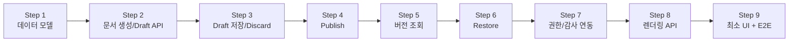

# Task 4-9: 구현 우선순위 및 MVP 범위 확정

## 1. 작업 목적

Phase 4 설계 산출물(Task 4-1~4-8)을 실제 구현 가능한 작업 묶음으로 재정렬하고 MVP 범위를 확정한다.

- Phase 4 설계 산출물을 구현 관점으로 재정리
- 필수 기능과 확장 기능 분리로 초기 구현 복잡도 통제
- Backend 우선 구현 범위 확정
- 이후 UI 연결 포인트 기준선 마련
- 핵심 흐름부터 검증하는 테스트 우선순위 정의

---

## 2. Phase 4 기능 재분류

설계 산출물에서 도출된 기능 항목을 구현 관점으로 재분류한다.

| 기능 | 설계 완료 | 구현 난이도 | 선행 의존성 | MVP 포함 |
|------|---------|-----------|-----------|---------|
| Document 모델 (version 포인터 포함) | O | 낮음 | 없음 | 필수 |
| Version 모델 (restored_from 등 확장) | O | 낮음 | Document 모델 | 필수 |
| Node 모델 + content_snapshot 저장 | O | 중간 | Version 모델 | 필수 |
| 문서 생성 API | O | 낮음 | Document 모델 | 필수 |
| 문서 메타 수정 API | O | 낮음 | Document 모델 | 필수 |
| Draft 저장 API (PUT /draft) | O | 중간 | Version + Node 모델 | 필수 |
| Publish API (POST /publish) | O | 중간 | Draft 저장 + 포인터 관리 | 필수 |
| 버전 목록 조회 API | O | 낮음 | Version 모델 | 필수 |
| 버전 상세 조회 API | O | 낮음 | Version + Node 모델 | 필수 |
| Restore API | O | 중간 | Publish + 포인터 관리 | 필수 |
| 렌더링 ViewModel 변환 | O | 중간 | content_snapshot 구조 | 필수 |
| 렌더링 API (`/render`) | O | 중간 | ViewModel 변환 | 필수 |
| Draft discard API | O | 낮음 | Draft 저장 | 필수 |
| 기본 권한 검사 | O | 중간 | 모든 서비스 로직 | 필수 |
| 핵심 감사 이벤트 기록 | O | 중간 | Publish + Restore + 권한 | 필수 |
| fallback 블록 렌더링 | O | 낮음 | ViewModel 변환 | 필수 |
| 버전 상태 필터링 (published/draft) | O | 낮음 | 버전 목록 조회 | 포함 |
| Restore 충돌 409 처리 | O | 낮음 | Restore API | 필수 |
| 다중 Draft 지원 | X | 높음 | - | **제외** |
| 승인 워크플로 | X | 매우 높음 | - | **제외** |
| diff 비교 | X | 높음 | - | **제외** |
| import/export | X | 높음 | - | **제외** |
| 고급 감사 운영자 UI | X | 높음 | - | **제외** |

---

## 3. 필수 기능 / 확장 기능 분리

### 3.1 MVP 필수 기능

| 기능 | 포함 근거 |
|------|---------|
| Document + Version + Node 핵심 모델 | 모든 기능의 토대 |
| 문서 생성 | MVP 시작점 |
| Draft 생성/저장 | 편집 핵심 |
| Publish | 문서 공식화 핵심 |
| Draft discard | Restore/재편집 선행 조건 |
| 버전 목록/상세 조회 | 이력 탐색 핵심 |
| Restore | 과거 버전 복귀 핵심 |
| 렌더링 API (published + draft) | 문서 열람 핵심 |
| fallback 블록 처리 | 렌더링 안정성 |
| 기본 권한 검사 (editor/publisher/admin) | 보안 기본선 |
| Publish/Restore 감사 이벤트 | 추적 기본선 |
| Restore 충돌(409) 처리 | 안전성 필수 |

### 3.2 확장 기능 (MVP 이후)

| 기능 | 제외 근거 | 후속 Phase |
|------|---------|-----------|
| 다중 Draft | 단일 Draft 정책으로 충분 | Phase 6 |
| 승인 워크플로 | 조직 복잡도 필요 | Phase 7 |
| diff 비교 | 버전 조회만으로도 복원 판단 가능 | Phase 5 |
| import/export | 외부 포맷 의존성 | Phase 6 |
| 고급 감사 운영자 UI | 콘솔 별도 개발 필요 | Phase 6 |
| 협업 실시간 편집 | 아키텍처 변경 필요 | Phase 8+ |
| 고급 템플릿 | document_type config 먼저 안정화 | Phase 5 |
| 세분화된 notification | 이벤트 시스템 필요 | Phase 6 |
| 실시간 동기화 | WebSocket 아키텍처 필요 | Phase 8+ |
| render warning 집계 고도화 | 기본 fallback으로 충분 | Phase 5 |

---

## 4. MVP 목표 정의

### 4.1 MVP 정의

**Phase 4 MVP는 다음을 가능하게 하는 수준이다:**

> 사용자가 문서를 생성하고, 내용을 Draft로 작성·저장하며, 검토 후 Published 상태로 발행할 수 있다. 발행된 문서는 버전 이력으로 관리되며, 과거 발행본 기준으로 새 Draft를 복원하고 재편집할 수 있다. 모든 행위는 기본 권한 검사와 핵심 감사 이벤트 기록 위에서 동작한다.

### 4.2 MVP 후 가능한 것

- 문서 생성 / Draft 작성 / Published 발행 / 버전 이력 조회 / 버전 기반 복원 / 문서 렌더링 조회
- 역할 기반 기본 권한 제어 (viewer/editor/publisher/admin)
- Publish/Restore 감사 이벤트 추적

### 4.3 MVP 후에도 불가능한 것

- 병렬 Draft 작업, 승인 흐름, 비교(diff), import/export, 실시간 협업

---

## 5. MVP 사용자 시나리오

| # | 시나리오 | 시작 상태 | 사용자 행위 | 시스템 결과 | 관련 API | 테스트 필요 | MVP 필수 |
|---|---------|---------|-----------|-----------|---------|-----------|---------|
| S1 | 새 문서 생성 → Draft 저장 | 없음 | 문서 생성 후 초안 작성 | Document + Draft Version + Nodes 생성 | POST /documents, PUT /draft | O | 필수 |
| S2 | Draft 편집 반복 → Publish | Draft 있음 | 내용 수정 후 발행 | Draft → Published, current_published 포인터 갱신 | PUT /draft, POST /publish | O | 필수 |
| S3 | Published 문서 조회 | Published 있음 | 읽기 전용 조회 | Published 렌더링 반환 | GET /documents/{id}/render | O | 필수 |
| S4 | Published 후 새 Draft 생성 | Published 있음, no draft | 재편집 시작 | 새 Draft 생성 (PUT /draft) | PUT /draft | O | 필수 |
| S5 | 버전 목록 조회 → 버전 상세 | 여러 버전 있음 | 이력 탐색 | 목록 + 특정 버전 메타+content | GET /versions, GET /versions/{vid} | O | 필수 |
| S6 | 과거 버전 기준 Restore | no draft | 복원 요청 | 새 Draft(restored_from 기록), current_draft 갱신 | POST /versions/{vid}/restore | O | 필수 |
| S7 | 권한 없는 Publish 차단 | editor 역할 | Publish 시도 | 403 Forbidden + access_denied 이벤트 | POST /publish | O | 필수 |
| S8 | Publish/Restore 감사 기록 | 정상 발행/복원 | 발행 또는 복원 실행 | audit_event 기록 확인 | - | O | 필수 |

---

## 6. Backend 우선 구현 범위

### 구현 단계 로드맵



### 단계별 목표 및 완료 기준

#### Step 1. 데이터 모델/저장 구조 구현

| 항목 | 내용 |
|------|------|
| 목표 | Document / Version / Node 모델 확장 및 마이그레이션 |
| 선행 조건 | 없음 |
| 핵심 작업 | Document에 `current_draft_version_id`, `current_published_version_id` 추가; Version에 `parent_version_id`, `restored_from_version_id`, `*_snapshot`, `published_by`, `published_at` 추가 |
| 완료 기준 | 마이그레이션 성공, 기존 데이터 호환 확인 |
| 다음 단계 | Step 2 (모델 기반 서비스 로직) |

#### Step 2. 문서 생성 / 초기 Draft API

| 항목 | 내용 |
|------|------|
| 목표 | POST /documents, PUT /documents/{id}/draft (최초 생성) |
| 선행 조건 | Step 1 |
| 핵심 작업 | 문서 생성 서비스, Draft Version 생성, Node 저장, content_snapshot 저장 |
| 완료 기준 | S1 시나리오 통과 |
| 다음 단계 | Step 3 |

#### Step 3. Draft 저장 / Discard

| 항목 | 내용 |
|------|------|
| 목표 | PUT /draft (기존 Draft 교체), DELETE /draft |
| 선행 조건 | Step 2 |
| 핵심 작업 | 단일 Active Draft 정책 enforcement, content_snapshot 원자적 교체 |
| 완료 기준 | Draft 반복 저장 + discard 후 재생성 정상 동작 |
| 다음 단계 | Step 4 |

#### Step 4. Publish

| 항목 | 내용 |
|------|------|
| 목표 | POST /documents/{id}/publish |
| 선행 조건 | Step 3 |
| 핵심 작업 | Draft→Published 상태 전이, current_published_version_id 갱신, 기존 published → superseded, 이전 Draft 포인터 null화 |
| 완료 기준 | S2 시나리오 통과 |
| 다음 단계 | Step 5 |

#### Step 5. 버전 목록/상세 조회

| 항목 | 내용 |
|------|------|
| 목표 | GET /documents/{id}/versions, GET /documents/{id}/versions/{vid} |
| 선행 조건 | Step 4 |
| 핵심 작업 | is_current_published / is_current_draft 계산, can_restore 동적 계산, content_snapshot 포함 |
| 완료 기준 | S5 시나리오 통과 |
| 다음 단계 | Step 6 |

#### Step 6. Restore

| 항목 | 내용 |
|------|------|
| 목표 | POST /documents/{id}/versions/{vid}/restore |
| 선행 조건 | Step 5 |
| 핵심 작업 | 복원 가능 버전 검증, 새 Draft 생성, restored_from_version_id 기록, 409 충돌 처리 |
| 완료 기준 | S6 시나리오 통과, S7과 충돌 처리 통과 |
| 다음 단계 | Step 7 |

#### Step 7. 권한 / 감사 연동

| 항목 | 내용 |
|------|------|
| 목표 | 역할별 권한 검사 미들웨어, 핵심 감사 이벤트 적재 |
| 선행 조건 | Step 2~6 (모든 서비스 로직) |
| 핵심 작업 | 403/409 처리, document_published/version_restored/access_denied 이벤트 기록 |
| 완료 기준 | S7/S8 시나리오 통과 |
| 다음 단계 | Step 8 |

#### Step 8. 렌더링 ViewModel / render API

| 항목 | 내용 |
|------|------|
| 목표 | GET /documents/{id}/render, GET /documents/{id}/versions/{vid}/render |
| 선행 조건 | Step 5 (content_snapshot 조회) |
| 핵심 작업 | NodeTree 정규화, ViewModel 변환, TOC 파생, fallback block 생성, status_badge 주입 |
| 완료 기준 | S3 시나리오 통과, 미지원 블록 fallback 정상 처리 |
| 다음 단계 | Step 9 |

#### Step 9. 최소 UI 연결 / E2E 검증

| 항목 | 내용 |
|------|------|
| 목표 | 최소 UI 또는 API 클라이언트로 전체 흐름 검증 |
| 선행 조건 | Step 1~8 |
| 핵심 작업 | S1~S8 시나리오 E2E 통과, 기본 읽기 화면 + Draft 편집 화면 연결 |
| 완료 기준 | MVP 체크리스트 전체 통과 |

---

## 7. UI 연결 포인트

| UI 화면 | 연결 시점 | 우선순위 | 비고 |
|--------|---------|---------|------|
| 문서 생성 화면 | Step 2 완료 후 | 높음 | 간단한 폼으로 시작 가능 |
| Draft 편집 화면 | Step 3 완료 후 | 높음 | 초기에는 JSON 에디터 또는 심플 에디터 허용 |
| Published 읽기 화면 | Step 8 완료 후 | 높음 | 렌더링 API 연동 |
| 버전 히스토리 목록 화면 | Step 5 완료 후 | 중간 | 테이블 뷰로 시작 |
| 버전 상세/복원 진입 화면 | Step 6 완료 후 | 중간 | 복원 확인 다이얼로그 포함 |
| 감사/운영자 UI | MVP 이후 | 낮음 | Phase 6으로 미룸 |

**UI 초기화 원칙**: Draft 편집 화면은 초기에 WYSIWYG 에디터 없이도 JSON 기반 또는 마크다운 에디터로 MVP 검증 가능. WYSIWYG는 Phase 5에서 추가.

---

## 8. 테스트 우선순위

| 테스트명 | 우선순위 | 유형 | 이유 | MVP 차단 |
|---------|---------|------|------|---------|
| 문서 생성 성공 | 상 | API integration | 모든 흐름의 시작 | Yes |
| Draft 저장 성공 | 상 | API integration | 편집 핵심 | Yes |
| Draft 단수 정책 (중복 Draft 차단) | 상 | service | 충돌 방지 핵심 | Yes |
| Publish 성공 (Draft→Published 전이) | 상 | API integration | 가장 중요한 상태 전이 | Yes |
| Publish 권한 실패 (403) | 상 | API integration | 보안 기본선 | Yes |
| Draft 없는 Publish 실패 (409) | 상 | API integration | 상태 전이 방어 | Yes |
| Restore 성공 (새 Draft 생성) | 상 | API integration | 복원 핵심 흐름 | Yes |
| Active Draft 있을 때 Restore 실패 (409) | 상 | API integration | 충돌 처리 핵심 | Yes |
| 버전 목록 조회 (is_current_* 정확성) | 상 | API integration | 이력 탐색 | Yes |
| 버전 상세 조회 (content_snapshot 포함) | 중 | API integration | 복원 판단 지원 | No |
| render 변환 성공 (published) | 상 | service | 읽기 화면 전제 | Yes |
| fallback block 처리 (unknown type) | 중 | unit/service | 안정성 | No |
| Publish 감사 이벤트 기록 | 중 | integration | 추적성 | No |
| Restore 감사 이벤트 기록 | 중 | integration | 추적성 | No |
| viewer Draft 조회 차단 | 중 | API | 권한 기본선 | No |

---

## 9. MVP 제외 항목

| 제외 항목 | 제외 이유 | 후속 단계 |
|---------|---------|---------|
| 다중 Draft | 단일 Draft 정책으로 MVP 충분, 복잡도 과도 | Phase 6 |
| 승인 워크플로 | 조직 구조 전제, Phase 4 범위 밖 | Phase 7 |
| diff 비교 화면 | 버전 조회+복원으로 MVP 가치 충분 | Phase 5 |
| import/export | 외부 포맷 파서 별도 개발 필요 | Phase 6 |
| 고급 감사/운영자 UI | 운영 콘솔 별도 기획 필요 | Phase 6 |
| WYSIWYG 편집기 | 렌더링 에디터 통합 별도 작업 | Phase 5 |
| 협업 실시간 편집 | WebSocket/CRDT 아키텍처 필요 | Phase 8+ |
| 고급 템플릿/document_type config UI | config 시스템 별도 설계 필요 | Phase 5 |
| notification/알림 | 이벤트 브로커 필요 | Phase 6 |
| 실시간 동기화 | 별도 아키텍처 결정 필요 | Phase 8+ |
| render warning 고도화 | fallback 기본으로 충분 | Phase 5 |

---

## 10. 구현 산출물 체크리스트

### 데이터 모델

- [ ] Document 모델: `current_draft_version_id`, `current_published_version_id` 추가 마이그레이션 완료
- [ ] Version 모델: `parent_version_id`, `restored_from_version_id`, `title_snapshot`, `summary_snapshot`, `metadata_snapshot`, `published_by`, `published_at` 추가 마이그레이션 완료
- [ ] Node 모델: 기존 구조 유지 (추가 변경 없음)

### API 구현

- [ ] `POST /api/v1/documents` — 문서 생성
- [ ] `GET /api/v1/documents/{id}` — 현재 문서 조회 (`?view=published|draft`)
- [ ] `PATCH /api/v1/documents/{id}` — 문서 메타 수정
- [ ] `PUT /api/v1/documents/{id}/draft` — Draft 저장 (생성 또는 전체 교체)
- [ ] `DELETE /api/v1/documents/{id}/draft` — Draft 폐기
- [ ] `POST /api/v1/documents/{id}/publish` — Draft → Published 발행
- [ ] `GET /api/v1/documents/{id}/versions` — 버전 목록 조회
- [ ] `GET /api/v1/documents/{id}/versions/{vid}` — 버전 상세 조회
- [ ] `POST /api/v1/documents/{id}/versions/{vid}/restore` — 과거 버전 복원
- [ ] `GET /api/v1/documents/{id}/render` — 현재 문서 렌더링
- [ ] `GET /api/v1/documents/{id}/versions/{vid}/render` — 특정 버전 렌더링

### 서비스 로직

- [ ] 단일 Active Draft 정책 enforcement 완료
- [ ] Publish 상태 전이 로직 (Draft→Published, 기존 Published→Superseded) 완료
- [ ] Restore 충돌 검증 (Active Draft 존재 시 409) 완료
- [ ] is_current_published / is_current_draft / can_restore 동적 계산 완료
- [ ] ViewModel 변환 파이프라인 완료
- [ ] fallback block 처리 완료

### 권한/감사

- [ ] 역할별 권한 검사 (viewer/editor/publisher/admin) 완료
- [ ] document_published 감사 이벤트 기록 완료
- [ ] version_restored 감사 이벤트 기록 완료
- [ ] access_denied 감사 이벤트 기록 완료
- [ ] state_transition_denied 감사 이벤트 기록 완료

### 테스트

- [ ] MVP 핵심 시나리오 S1~S8 통과 (API integration)
- [ ] 권한 실패 테스트 통과 (403/409)
- [ ] Restore 충돌 처리 테스트 통과
- [ ] fallback block 단위 테스트 통과

### UI 최소 연결

- [ ] 문서 생성 + Draft 편집 화면 최소 동작
- [ ] Published 읽기 화면 렌더링 API 연동
- [ ] 버전 히스토리 목록 화면 최소 동작

---

## 11. 권장 MVP/우선순위안 (요약)

### MVP 포함 기능

```
문서 생성 → Draft 저장/수정/폐기 → Publish → 버전 목록/상세 조회 → Restore → 렌더링 조회
+ 기본 권한 검사 (editor/publisher/admin)
+ 핵심 감사 이벤트 (Publish/Restore/access_denied/state_transition_denied)
```

### MVP 제외 기능

```
다중 Draft, 승인 워크플로, diff 비교, import/export, 운영자 UI, WYSIWYG, 실시간 협업
```

### Backend 구현 순서

```
Step 1(모델) → Step 2(생성/Draft) → Step 3(Draft 저장/폐기) → Step 4(Publish)
→ Step 5(버전 조회) → Step 6(Restore) → Step 7(권한/감사) → Step 8(렌더링) → Step 9(UI+E2E)
```

### UI 연결 시점

- **Draft 편집 화면**: Step 3 완료 후 (JSON 에디터 허용)
- **Published 읽기 화면**: Step 8 완료 후
- **버전 이력 화면**: Step 5 완료 후

### 테스트 최우선 항목

1. Publish 흐름 (성공 + 권한 실패 + 상태 실패)
2. Restore 흐름 (성공 + Active Draft 충돌)
3. 단일 Active Draft 정책
4. 버전 조회 is_current_* 정확성

### Phase 4 완료 판단 기준

> MVP 체크리스트 전 항목 완료 + S1~S8 시나리오 E2E 통과 + 기본 권한/감사 동작 확인

---

## 12. 후속 작업 영향도

| 후속 작업 | 이 문서의 영향 |
|---------|-------------|
| 구현 착수 | Step 1~9 로드맵이 구현 순서 기준 |
| 테스트 계획서 | §8 테스트 우선순위 + §5 시나리오가 테스트 케이스 기초 |
| Phase 4 통합 검수 | §10 체크리스트가 검수 기준 |
| Phase 5 계획 | diff, WYSIWYG, 고급 렌더링 등 확장 기능 우선 검토 대상 |
| Phase 6 계획 | import/export, 운영자 UI, notification 등 |
| UI 팀 협업 | §7 UI 연결 포인트가 프론트엔드 착수 기준 |
