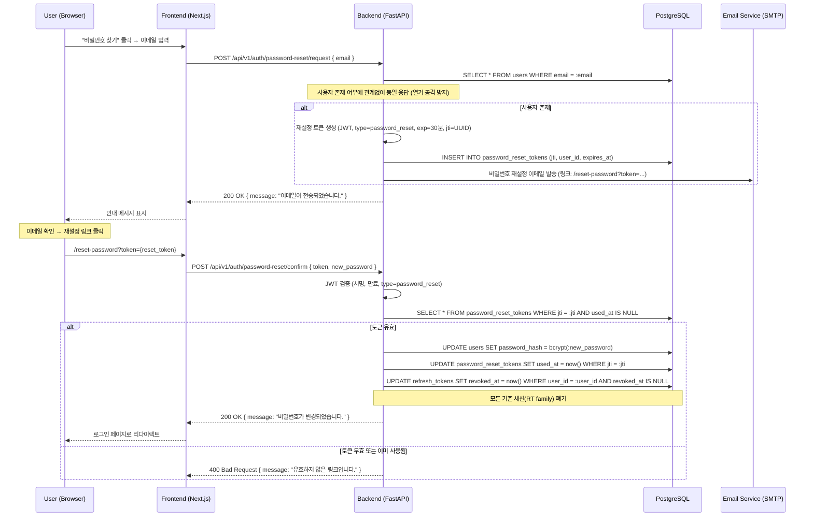

# 인증 플로우 시퀀스 다이어그램

> Phase 14 — Task 14-1 산출물 1/5
> 작성일: 2026-04-13

---

## 1. 이메일/비밀번호 로그인 플로우

```mermaid
sequenceDiagram
    participant U as User (Browser)
    participant F as Frontend (Next.js)
    participant B as Backend (FastAPI)
    participant V as Valkey
    participant DB as PostgreSQL

    U->>F: 이메일/비밀번호 입력 후 로그인 버튼 클릭
    F->>B: POST /api/v1/auth/login { email, password }

    B->>V: GET login_attempts:{email}
    alt 시도 횟수 >= 5 (잠금 상태)
        V-->>B: count >= 5
        B-->>F: 429 Too Many Requests { message: "계정이 잠겼습니다. 15분 후 재시도하세요." }
        F-->>U: 에러 메시지 표시
    else 잠금 아님
        V-->>B: count < 5

        B->>DB: SELECT * FROM users WHERE email = :email
        alt 사용자 미존재
            DB-->>B: None
            B->>V: INCR login_attempts:{email}, EXPIRE 900
            B-->>F: 401 Unauthorized { message: "이메일 또는 비밀번호가 올바르지 않습니다." }
            F-->>U: 에러 메시지 표시
        else 사용자 존재
            DB-->>B: User row

            B->>B: bcrypt.verify(password, user.password_hash)
            alt 비밀번호 불일치
                B->>V: INCR login_attempts:{email}, EXPIRE 900
                B-->>F: 401 Unauthorized { message: "이메일 또는 비밀번호가 올바르지 않습니다." }
                F-->>U: 에러 메시지 표시
            else 비밀번호 일치
                B->>V: DEL login_attempts:{email}

                B->>B: Access Token 생성 (HS256, 15분, jti, sub, role, type=access)
                B->>B: Refresh Token 생성 (jti, family_id=UUID, sub, type=refresh)
                B->>DB: INSERT INTO refresh_tokens (jti, family_id, user_id, expires_at)

                B->>DB: UPDATE users SET last_login_at = now()

                B-->>F: 200 OK
                Note over B,F: Response Body: { access_token, token_type, expires_in: 900 }<br/>Set-Cookie: refresh_token=RT; HttpOnly; Secure; SameSite=Strict; Path=/api/v1/auth; Max-Age=604800

                F->>F: access_token → 메모리 저장 (변수/Context)
                F-->>U: 메인 페이지로 리다이렉트
            end
        end
    end
```

### 설계 포인트

- **동일 에러 메시지**: 사용자 미존재와 비밀번호 불일치에 동일한 메시지를 반환하여 이메일 열거 공격(Enumeration Attack)을 방지한다.
- **잠금 카운터**: Valkey의 `EXPIRE`를 활용하여 15분 후 자동 해제된다. 별도의 해제 배치가 불필요하다.
- **Refresh Token 쿠키 경로**: `Path=/api/v1/auth`로 제한하여 다른 API 호출에 불필요한 쿠키 전송을 방지한다.
- **Access Token 전달**: Response Body로 전달하여 프론트엔드가 메모리에 저장한다. Cookie가 아닌 메모리 저장으로 XSS 완화 (Cookie는 CSRF 위험).

---

## 2. GitLab OAuth2/OIDC 플로우

```mermaid
sequenceDiagram
    participant U as User (Browser)
    participant F as Frontend (Next.js)
    participant B as Backend (FastAPI)
    participant GL as GitLab (OAuth/OIDC)
    participant V as Valkey
    participant DB as PostgreSQL

    U->>F: "GitLab으로 로그인" 버튼 클릭
    F->>B: GET /api/v1/auth/oauth/gitlab

    B->>B: state(random) 생성, code_verifier/code_challenge(PKCE S256) 생성
    B->>V: SET oauth_state:{state} = { code_verifier, redirect_uri, created_at } EX 600

    B-->>U: 302 Redirect → GitLab Authorize URL
    Note over B,GL: https://{GITLAB_BASE_URL}/oauth/authorize<br/>?client_id=...&redirect_uri=...&response_type=code<br/>&scope=openid+profile+email+read_user<br/>&state={state}&code_challenge={challenge}&code_challenge_method=S256

    U->>GL: GitLab 로그인 화면에서 인증
    GL->>GL: 사용자 인증 및 권한 동의

    GL-->>U: 302 Redirect → {REDIRECT_URI}?code={auth_code}&state={state}
    U->>B: GET /api/v1/auth/oauth/gitlab/callback?code={auth_code}&state={state}

    B->>V: GET oauth_state:{state}
    alt state 미존재 또는 만료
        V-->>B: None
        B-->>F: 302 Redirect → /login?error=invalid_state
    else state 유효
        V-->>B: { code_verifier, redirect_uri }
        B->>V: DEL oauth_state:{state}

        B->>GL: POST /oauth/token { grant_type=authorization_code, code, redirect_uri, client_id, client_secret, code_verifier }
        GL-->>B: { access_token, id_token, refresh_token, token_type, expires_in }

        B->>GL: GET /api/v4/user (Authorization: Bearer {gitlab_access_token})
        GL-->>B: { id, email, name, avatar_url, username }

        B->>DB: SELECT * FROM oauth_accounts WHERE provider='gitlab' AND provider_user_id=:gitlab_id
        alt OAuth 계정 존재
            DB-->>B: OAuthAccount row (with user_id)
            B->>DB: UPDATE oauth_accounts SET access_token_enc=..., updated_at=now()
        else OAuth 계정 미존재
            B->>DB: SELECT * FROM users WHERE email = :gitlab_email
            alt 이메일로 기존 계정 존재
                DB-->>B: User row
                B->>DB: INSERT INTO oauth_accounts (user_id, provider, provider_user_id, ...)
                Note over B,DB: 기존 계정에 GitLab 연결
            else 완전 신규 사용자
                B->>DB: INSERT INTO users (email, display_name, is_email_verified=true, auth_provider='gitlab')
                B->>DB: INSERT INTO oauth_accounts (user_id, provider, provider_user_id, ...)
                B->>DB: INSERT INTO organization_members (user_id, org_id, role='VIEWER')
                Note over B,DB: 신규 계정 생성 + 기본 조직 배정
            end
        end

        B->>B: Access Token 생성 (HS256, 15분)
        B->>B: Refresh Token 생성 (family_id=UUID)
        B->>DB: INSERT INTO refresh_tokens (jti, family_id, user_id, expires_at)

        B-->>U: 302 Redirect → /auth/callback?access_token={AT}
        Note over B,U: Set-Cookie: refresh_token=RT; HttpOnly; Secure; SameSite=Strict

        U->>F: /auth/callback 페이지 로드
        F->>F: URL에서 access_token 추출 → 메모리 저장
        F->>F: URL에서 access_token 파라미터 제거 (history.replaceState)
        F-->>U: 메인 페이지로 리다이렉트
    end
```

### 설계 포인트

- **PKCE (S256)**: Authorization Code 가로채기 공격 방지. `code_verifier`는 Valkey에 state와 함께 저장하고, 콜백 시 사용 후 즉시 삭제한다.
- **state 검증**: CSRF 방지. Valkey에 저장하여 10분 TTL로 자동 만료된다.
- **계정 연결 전략**: GitLab 이메일과 동일한 이메일의 기존 계정이 있으면 자동 연결한다. 이메일 미일치 시 신규 계정을 생성한다.
- **GitLab Token 암호화**: GitLab에서 받은 access_token/refresh_token은 AES-256-GCM으로 암호화하여 `oauth_accounts` 테이블에 저장한다.
- **Self-managed 지원**: `GITLAB_BASE_URL` 환경 변수로 GitLab.com과 Self-managed 인스턴스를 모두 지원한다. OIDC Discovery URL도 이 base URL에서 파생한다.
- **AT 전달 방식**: 콜백 리다이렉트 시 URL 파라미터로 AT를 전달하고, 프론트엔드에서 즉시 추출 후 URL을 정리한다. Fragment(`#`)를 사용하면 서버에 전달되지 않아 더 안전하지만, Next.js SSR과의 호환성을 위해 query parameter + 즉시 제거 방식을 채택한다.

---

## 3. 토큰 갱신 (Silent Refresh) 플로우

```mermaid
sequenceDiagram
    participant F as Frontend (Next.js)
    participant B as Backend (FastAPI)
    participant V as Valkey
    participant DB as PostgreSQL

    Note over F: Access Token 만료 감지 (exp claim 확인 또는 401 수신)

    F->>B: POST /api/v1/auth/refresh
    Note over F,B: Cookie에 refresh_token 자동 포함 (SameSite=Strict)

    B->>B: Refresh Token 디코딩 및 서명 검증

    alt RT 디코딩 실패 또는 만료
        B-->>F: 401 Unauthorized { code: "REFRESH_TOKEN_EXPIRED" }
        F->>F: 로그인 페이지로 리다이렉트
    else RT 유효
        B->>DB: SELECT * FROM refresh_tokens WHERE jti = :rt_jti
        alt DB에 RT 미존재 (이미 사용됨 → 탈취 의심)
            DB-->>B: None
            B->>B: RT에서 family_id 추출
            B->>DB: UPDATE refresh_tokens SET revoked_at = now() WHERE family_id = :family_id AND revoked_at IS NULL
            Note over B,DB: 해당 family 전체 폐기 (Rotation Reuse Detection)
            B-->>F: 401 Unauthorized { code: "TOKEN_REUSE_DETECTED" }
            F->>F: 로그인 페이지로 리다이렉트 + 보안 경고
        else DB에 RT 존재 (미사용)
            B->>DB: UPDATE refresh_tokens SET used_at = now() WHERE jti = :rt_jti
            Note over B,DB: 기존 RT를 "사용됨"으로 표시

            B->>B: 새 Access Token 생성 (HS256, 15분)
            B->>B: 새 Refresh Token 생성 (같은 family_id, 새 jti)
            B->>DB: INSERT INTO refresh_tokens (jti, family_id, user_id, expires_at)

            B-->>F: 200 OK
            Note over B,F: Response Body: { access_token, token_type, expires_in: 900 }<br/>Set-Cookie: refresh_token=NEW_RT; HttpOnly; Secure; SameSite=Strict; Path=/api/v1/auth; Max-Age=604800

            F->>F: 새 access_token → 메모리 저장
            F->>F: 대기 중이던 API 요청 재시도
        end
    end
```

### 설계 포인트

- **Rotation Reuse Detection**: 이미 사용된 RT가 다시 제출되면, 해당 family 전체를 폐기한다. 이는 RT가 탈취되어 공격자와 정상 사용자가 동시에 갱신을 시도하는 시나리오에 대응한다.
- **Silent Refresh 타이밍**: 프론트엔드에서 AT의 `exp` claim을 확인하여, 만료 1분 전에 선제적으로 갱신을 시도한다. 만료 후 401을 받은 경우에도 갱신을 시도한다.
- **동시 갱신 요청 처리**: 프론트엔드에서 갱신 요청을 단일화(queuing)하여, 동시에 여러 탭/요청에서 갱신을 시도하더라도 하나의 요청만 실제로 전송한다.
- **Family 기반 만료**: RT가 만료되면 해당 family의 모든 RT가 자연 만료된다. 별도의 정리 배치가 `refresh_tokens` 테이블에서 만료된 레코드를 주기적으로 삭제한다.

---

## 4. 보조 플로우: 로그아웃

```mermaid
sequenceDiagram
    participant F as Frontend (Next.js)
    participant B as Backend (FastAPI)
    participant DB as PostgreSQL

    F->>B: POST /api/v1/auth/logout
    Note over F,B: Authorization: Bearer {AT}<br/>Cookie: refresh_token

    B->>B: AT에서 sub(user_id) 추출
    B->>B: RT에서 family_id 추출

    B->>DB: UPDATE refresh_tokens SET revoked_at = now() WHERE family_id = :family_id AND revoked_at IS NULL
    Note over B,DB: 현재 세션의 RT family 전체 폐기

    B-->>F: 200 OK
    Note over B,F: Set-Cookie: refresh_token=; Max-Age=0; Path=/api/v1/auth
    Note over B,F: 쿠키 삭제

    F->>F: 메모리에서 access_token 삭제
    F->>F: 로그인 페이지로 리다이렉트
```

---

## 5. 보조 플로우: 비밀번호 재설정



### 설계 포인트

- **1회용 토큰**: `password_reset_tokens` 테이블에서 `used_at`으로 사용 여부를 추적한다.
- **기존 세션 폐기**: 비밀번호 변경 시 해당 사용자의 모든 RT family를 폐기하여, 탈취된 세션이 있더라도 즉시 무효화한다.
- **동일 응답**: 이메일 존재 여부에 관계없이 "이메일이 전송되었습니다" 메시지를 반환한다.
